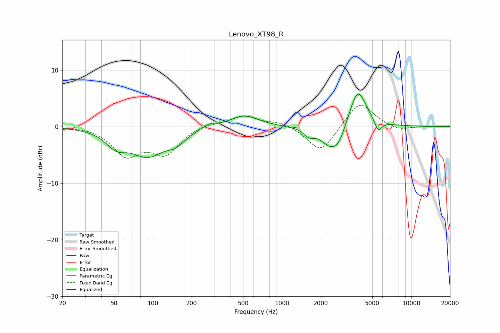

# Lenovo_XT98_R
See [usage instructions](https://github.com/jaakkopasanen/AutoEq#usage) for more options and info.

### Parametric EQs
Apply preamp of -5.8 dB when using parametric equalizer.

|   # | Type    |   Fc (Hz) |    Q |   Gain (dB) |
|-----|---------|-----------|------|-------------|
|   1 | Peaking |        52 | 1.8  |        -2.6 |
|   2 | Peaking |        91 | 1.09 |        -4.7 |
|   3 | Peaking |       151 | 1.95 |        -1.8 |
|   4 | Peaking |       275 | 2.75 |         0.8 |
|   5 | Peaking |       513 | 1.33 |         2   |
|   6 | Peaking |      1623 | 3.71 |        -1.2 |
|   7 | Peaking |      2409 | 1.82 |        -3.9 |
|   8 | Peaking |      2798 | 3.19 |        -1.6 |
|   9 | Peaking |      3866 | 2.14 |         7   |
|  10 | Peaking |      5564 | 5.21 |        -2   |

### Fixed Band EQs
When using fixed band (also called graphic) equalizer, apply preamp of **-3.8 dB** (if available) and set gains manually with these parameters.

|   # | Type    |   Fc (Hz) |    Q |   Gain (dB) |
|-----|---------|-----------|------|-------------|
|   1 | Peaking |        31 | 1.41 |         0.1 |
|   2 | Peaking |        62 | 1.41 |        -4.8 |
|   3 | Peaking |       125 | 1.41 |        -4.5 |
|   4 | Peaking |       250 | 1.41 |         0.6 |
|   5 | Peaking |       500 | 1.41 |         1.9 |
|   6 | Peaking |      1000 | 1.41 |         0.9 |
|   7 | Peaking |      2000 | 1.41 |        -4.7 |
|   8 | Peaking |      4000 | 1.41 |         4.6 |
|   9 | Peaking |      8000 | 1.41 |        -0.8 |
|  10 | Peaking |     16000 | 1.41 |         0.1 |

### Graphs

