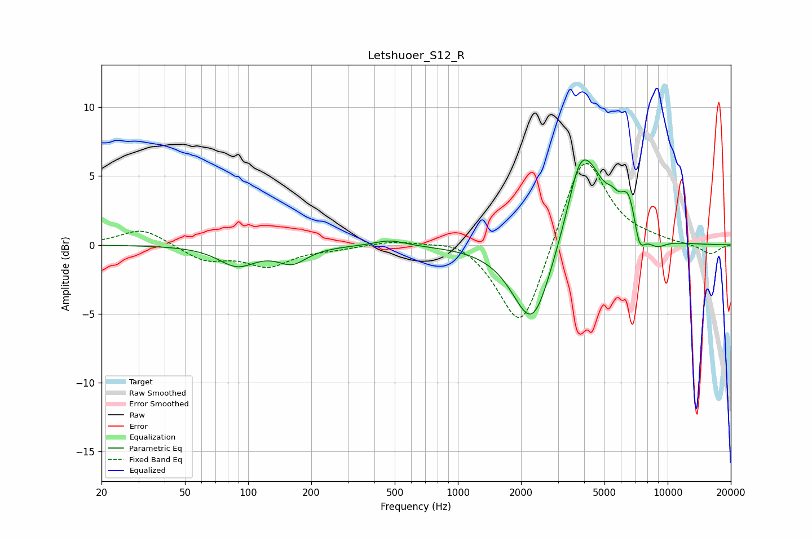

# Letshuoer_S12_R
See [usage instructions](https://github.com/jaakkopasanen/AutoEq#usage) for more options and info.

### Parametric EQs
Apply preamp of -6.3 dB when using parametric equalizer.

|   # | Type    |   Fc (Hz) |    Q |   Gain (dB) |
|-----|---------|-----------|------|-------------|
|   1 | Peaking |        88 | 1.62 |        -1.4 |
|   2 | Peaking |       162 | 2.02 |        -1.2 |
|   3 | Peaking |       474 | 1.91 |         0.4 |
|   4 | Peaking |      2266 | 1.52 |        -6.4 |
|   5 | Peaking |      3750 | 3.24 |         1.6 |
|   6 | Peaking |      4097 | 1.52 |         6.2 |
|   7 | Peaking |      5433 | 5    |         0.7 |
|   8 | Peaking |      6533 | 3.42 |         2.9 |
|   9 | Peaking |      7319 | 4.85 |        -2.1 |
|  10 | Peaking |      8839 | 2.81 |        -0.7 |

### Fixed Band EQs
When using fixed band (also called graphic) equalizer, apply preamp of **-6.0 dB** (if available) and set gains manually with these parameters.

|   # | Type    |   Fc (Hz) |    Q |   Gain (dB) |
|-----|---------|-----------|------|-------------|
|   1 | Peaking |        31 | 1.41 |         1.2 |
|   2 | Peaking |        62 | 1.41 |        -1.1 |
|   3 | Peaking |       125 | 1.41 |        -1.4 |
|   4 | Peaking |       250 | 1.41 |        -0.2 |
|   5 | Peaking |       500 | 1.41 |         0.3 |
|   6 | Peaking |      1000 | 1.41 |         0.6 |
|   7 | Peaking |      2000 | 1.41 |        -6.6 |
|   8 | Peaking |      4000 | 1.41 |         7   |
|   9 | Peaking |      8000 | 1.41 |         0.2 |
|  10 | Peaking |     16000 | 1.41 |        -0.7 |

### Graphs

