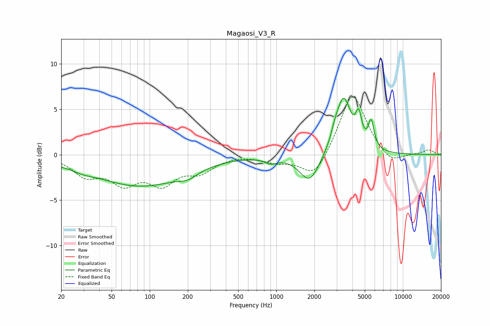

# Magaosi_V3_R
See [usage instructions](https://github.com/jaakkopasanen/AutoEq#usage) for more options and info.

### Parametric EQs
Apply preamp of -6.3 dB when using parametric equalizer.

|   # | Type    |   Fc (Hz) |    Q |   Gain (dB) |
|-----|---------|-----------|------|-------------|
|   1 | Peaking |        20 | 3.64 |        -0.2 |
|   2 | Peaking |        29 | 1.48 |        -0.5 |
|   3 | Peaking |        84 | 0.4  |        -3.4 |
|   4 | Peaking |       200 | 1.88 |        -0.7 |
|   5 | Peaking |       907 | 2.86 |        -0.6 |
|   6 | Peaking |      1831 | 1.82 |        -3.1 |
|   7 | Peaking |      2909 | 4.5  |         1   |
|   8 | Peaking |      3406 | 2.45 |         6.1 |
|   9 | Peaking |      4478 | 6    |         2.9 |
|  10 | Peaking |      5617 | 6    |         2.9 |

### Fixed Band EQs
When using fixed band (also called graphic) equalizer, apply preamp of **-6.4 dB** (if available) and set gains manually with these parameters.

|   # | Type    |   Fc (Hz) |    Q |   Gain (dB) |
|-----|---------|-----------|------|-------------|
|   1 | Peaking |        31 | 1.41 |        -2.1 |
|   2 | Peaking |        62 | 1.41 |        -2.7 |
|   3 | Peaking |       125 | 1.41 |        -2.8 |
|   4 | Peaking |       250 | 1.41 |        -1.6 |
|   5 | Peaking |       500 | 1.41 |         0   |
|   6 | Peaking |      1000 | 1.41 |        -0.7 |
|   7 | Peaking |      2000 | 1.41 |        -2.7 |
|   8 | Peaking |      4000 | 1.41 |         7   |
|   9 | Peaking |      8000 | 1.41 |        -1.2 |
|  10 | Peaking |     16000 | 1.41 |         0.5 |

### Graphs

