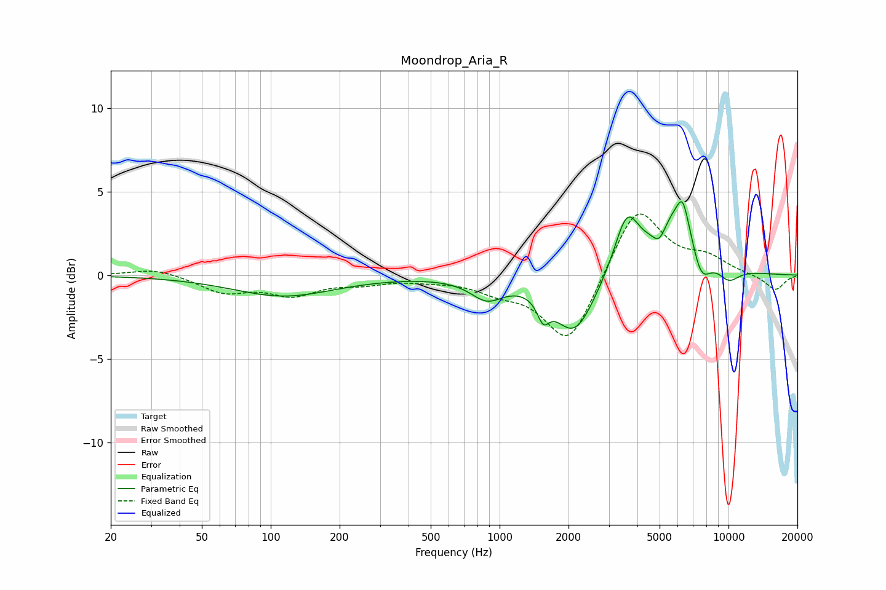

# Moondrop_Aria_R
See [usage instructions](https://github.com/jaakkopasanen/AutoEq#usage) for more options and info.

### Parametric EQs
Apply preamp of -4.5 dB when using parametric equalizer.

|   # | Type    |   Fc (Hz) |    Q |   Gain (dB) |
|-----|---------|-----------|------|-------------|
|   1 | Peaking |       114 | 0.63 |        -1.2 |
|   2 | Peaking |       880 | 1.98 |        -1.2 |
|   3 | Peaking |      1551 | 5.51 |        -1.3 |
|   4 | Peaking |      2124 | 1.58 |        -3.6 |
|   5 | Peaking |      3594 | 2.61 |         3.3 |
|   6 | Peaking |      4988 | 4.79 |        -1   |
|   7 | Peaking |      6199 | 1.36 |         4.4 |
|   8 | Peaking |      6308 | 6    |         1.2 |
|   9 | Peaking |      7537 | 2.84 |        -2.7 |
|  10 | Peaking |     10000 | 2.48 |        -0.9 |

### Fixed Band EQs
When using fixed band (also called graphic) equalizer, apply preamp of **-3.8 dB** (if available) and set gains manually with these parameters.

|   # | Type    |   Fc (Hz) |    Q |   Gain (dB) |
|-----|---------|-----------|------|-------------|
|   1 | Peaking |        31 | 1.41 |         0.4 |
|   2 | Peaking |        62 | 1.41 |        -1   |
|   3 | Peaking |       125 | 1.41 |        -1.1 |
|   4 | Peaking |       250 | 1.41 |        -0.4 |
|   5 | Peaking |       500 | 1.41 |        -0.2 |
|   6 | Peaking |      1000 | 1.41 |        -0.8 |
|   7 | Peaking |      2000 | 1.41 |        -4.2 |
|   8 | Peaking |      4000 | 1.41 |         4.3 |
|   9 | Peaking |      8000 | 1.41 |         0.9 |
|  10 | Peaking |     16000 | 1.41 |        -0.9 |

### Graphs

