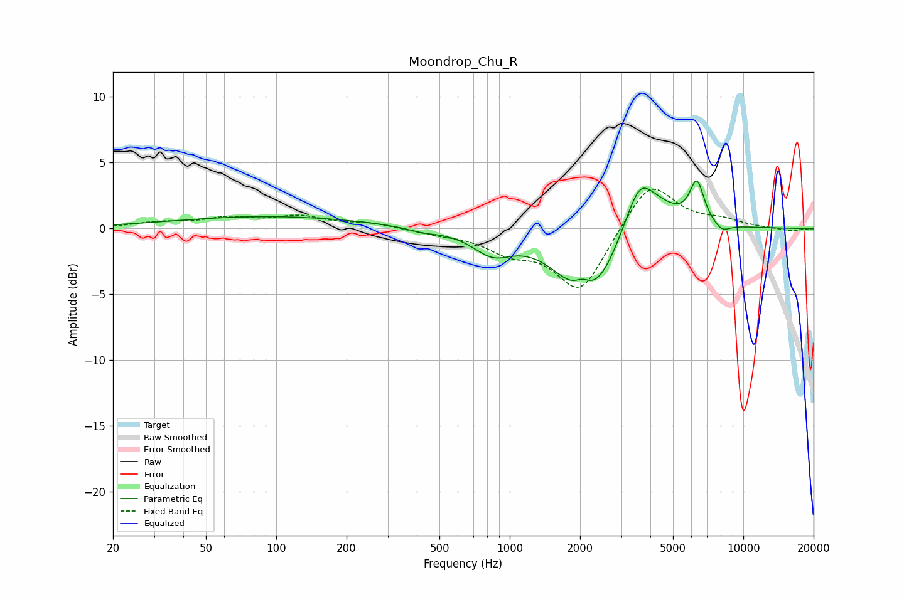

# Moondrop_Chu_R
See [usage instructions](https://github.com/jaakkopasanen/AutoEq#usage) for more options and info.

### Parametric EQs
Apply preamp of -3.7 dB when using parametric equalizer.

|   # | Type    |   Fc (Hz) |    Q |   Gain (dB) |
|-----|---------|-----------|------|-------------|
|   1 | Peaking |        94 | 0.33 |         0.9 |
|   2 | Peaking |       422 | 2.12 |        -0.3 |
|   3 | Peaking |       843 | 1.68 |        -1.6 |
|   4 | Peaking |      2022 | 1.17 |        -4   |
|   5 | Peaking |      2048 | 4.1  |         0.9 |
|   6 | Peaking |      2508 | 1.35 |        -2.5 |
|   7 | Peaking |      3596 | 3.15 |         1.3 |
|   8 | Peaking |      3645 | 1.24 |         4   |
|   9 | Peaking |      6328 | 4.53 |         3.1 |
|  10 | Peaking |      8099 | 3.64 |        -0.7 |

### Fixed Band EQs
When using fixed band (also called graphic) equalizer, apply preamp of **-3.1 dB** (if available) and set gains manually with these parameters.

|   # | Type    |   Fc (Hz) |    Q |   Gain (dB) |
|-----|---------|-----------|------|-------------|
|   1 | Peaking |        31 | 1.41 |         0.4 |
|   2 | Peaking |        62 | 1.41 |         0.7 |
|   3 | Peaking |       125 | 1.41 |         0.8 |
|   4 | Peaking |       250 | 1.41 |         0.4 |
|   5 | Peaking |       500 | 1.41 |        -0.3 |
|   6 | Peaking |      1000 | 1.41 |        -1.5 |
|   7 | Peaking |      2000 | 1.41 |        -4.8 |
|   8 | Peaking |      4000 | 1.41 |         3.8 |
|   9 | Peaking |      8000 | 1.41 |         0.5 |
|  10 | Peaking |     16000 | 1.41 |        -0.2 |

### Graphs

