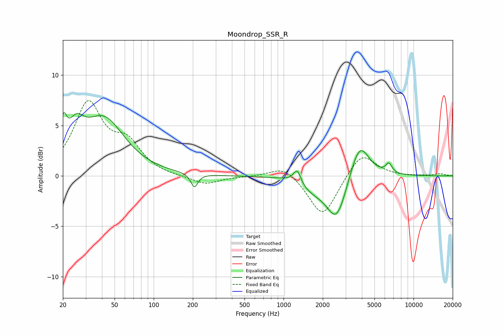

# Moondrop_SSR_R
See [usage instructions](https://github.com/jaakkopasanen/AutoEq#usage) for more options and info.

### Parametric EQs
Apply preamp of -6.4 dB when using parametric equalizer.

|   # | Type    |   Fc (Hz) |    Q |   Gain (dB) |
|-----|---------|-----------|------|-------------|
|   1 | Peaking |        20 | 5.63 |         3   |
|   2 | Peaking |        25 | 2.3  |         2.8 |
|   3 | Peaking |        41 | 0.9  |         5.5 |
|   4 | Peaking |       206 | 5.36 |        -1.4 |
|   5 | Peaking |      1123 | 1.43 |         0.3 |
|   6 | Peaking |      1271 | 5.01 |         1.4 |
|   7 | Peaking |      1666 | 1.14 |        -1.3 |
|   8 | Peaking |      2563 | 1.89 |        -4.1 |
|   9 | Peaking |      3839 | 1.92 |         3.7 |
|  10 | Peaking |      6458 | 5.57 |         0.9 |

### Fixed Band EQs
When using fixed band (also called graphic) equalizer, apply preamp of **-7.6 dB** (if available) and set gains manually with these parameters.

|   # | Type    |   Fc (Hz) |    Q |   Gain (dB) |
|-----|---------|-----------|------|-------------|
|   1 | Peaking |        31 | 1.41 |         7   |
|   2 | Peaking |        62 | 1.41 |         2.8 |
|   3 | Peaking |       125 | 1.41 |        -0.1 |
|   4 | Peaking |       250 | 1.41 |        -0.9 |
|   5 | Peaking |       500 | 1.41 |        -0.1 |
|   6 | Peaking |      1000 | 1.41 |         1.1 |
|   7 | Peaking |      2000 | 1.41 |        -4.2 |
|   8 | Peaking |      4000 | 1.41 |         2.5 |
|   9 | Peaking |      8000 | 1.41 |        -0   |
|  10 | Peaking |     16000 | 1.41 |         0.2 |

### Graphs

