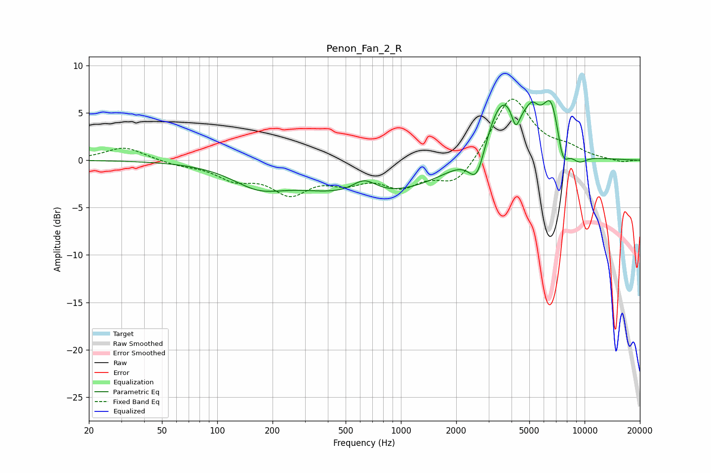

# Penon_Fan_2_R
See [usage instructions](https://github.com/jaakkopasanen/AutoEq#usage) for more options and info.

### Parametric EQs
Apply preamp of -6.4 dB when using parametric equalizer.

|   # | Type    |   Fc (Hz) |    Q |   Gain (dB) |
|-----|---------|-----------|------|-------------|
|   1 | Peaking |       166 | 1.02 |        -1.9 |
|   2 | Peaking |       632 | 2.06 |         1.6 |
|   3 | Peaking |       702 | 0.35 |        -3.8 |
|   4 | Peaking |      2595 | 2.98 |        -4.1 |
|   5 | Peaking |      3587 | 1.25 |         7.6 |
|   6 | Peaking |      4215 | 5.99 |        -2.5 |
|   7 | Peaking |      5185 | 3.69 |         2.1 |
|   8 | Peaking |      6577 | 2.93 |         5.2 |
|   9 | Peaking |      7604 | 4.37 |        -2.8 |
|  10 | Peaking |      9307 | 2.85 |        -1   |

### Fixed Band EQs
When using fixed band (also called graphic) equalizer, apply preamp of **-6.5 dB** (if available) and set gains manually with these parameters.

|   # | Type    |   Fc (Hz) |    Q |   Gain (dB) |
|-----|---------|-----------|------|-------------|
|   1 | Peaking |        31 | 1.41 |         1.4 |
|   2 | Peaking |        62 | 1.41 |        -0.4 |
|   3 | Peaking |       125 | 1.41 |        -1.7 |
|   4 | Peaking |       250 | 1.41 |        -3.1 |
|   5 | Peaking |       500 | 1.41 |        -1.8 |
|   6 | Peaking |      1000 | 1.41 |        -2.4 |
|   7 | Peaking |      2000 | 1.41 |        -2.7 |
|   8 | Peaking |      4000 | 1.41 |         6.8 |
|   9 | Peaking |      8000 | 1.41 |         1   |
|  10 | Peaking |     16000 | 1.41 |        -0.3 |

### Graphs

