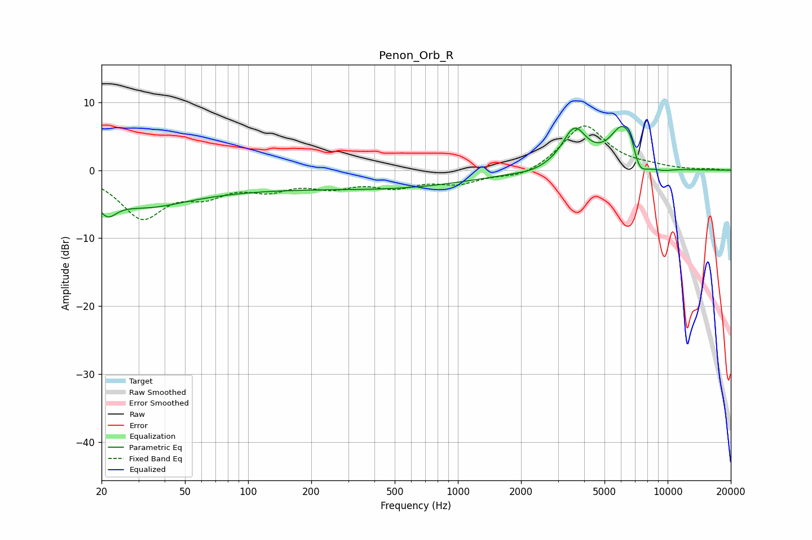

# Penon_Orb_R
See [usage instructions](https://github.com/jaakkopasanen/AutoEq#usage) for more options and info.

### Parametric EQs
Apply preamp of -6.5 dB when using parametric equalizer.

|   # | Type    |   Fc (Hz) |    Q |   Gain (dB) |
|-----|---------|-----------|------|-------------|
|   1 | Peaking |        21 | 3.12 |        -3   |
|   2 | Peaking |        31 | 0.68 |        -3.9 |
|   3 | Peaking |       172 | 0.4  |         0.7 |
|   4 | Peaking |       207 | 0.18 |        -3.4 |
|   5 | Peaking |      2261 | 2.18 |        -0.3 |
|   6 | Peaking |      3592 | 2.39 |         5.8 |
|   7 | Peaking |      6120 | 2.19 |         6.6 |
|   8 | Peaking |      6755 | 4.75 |         2.4 |
|   9 | Peaking |      7183 | 3.22 |        -4.2 |
|  10 | Peaking |      9330 | 2.09 |        -0.6 |

### Fixed Band EQs
When using fixed band (also called graphic) equalizer, apply preamp of **-6.6 dB** (if available) and set gains manually with these parameters.

|   # | Type    |   Fc (Hz) |    Q |   Gain (dB) |
|-----|---------|-----------|------|-------------|
|   1 | Peaking |        31 | 1.41 |        -6.6 |
|   2 | Peaking |        62 | 1.41 |        -2.8 |
|   3 | Peaking |       125 | 1.41 |        -2.3 |
|   4 | Peaking |       250 | 1.41 |        -2   |
|   5 | Peaking |       500 | 1.41 |        -2.1 |
|   6 | Peaking |      1000 | 1.41 |        -1.7 |
|   7 | Peaking |      2000 | 1.41 |        -1.2 |
|   8 | Peaking |      4000 | 1.41 |         6.7 |
|   9 | Peaking |      8000 | 1.41 |         0.4 |
|  10 | Peaking |     16000 | 1.41 |         0.1 |

### Graphs

