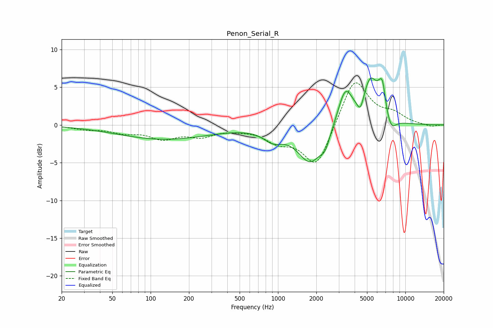

# Penon_Serial_R
See [usage instructions](https://github.com/jaakkopasanen/AutoEq#usage) for more options and info.

### Parametric EQs
Apply preamp of -6.3 dB when using parametric equalizer.

|   # | Type    |   Fc (Hz) |    Q |   Gain (dB) |
|-----|---------|-----------|------|-------------|
|   1 | Peaking |       127 | 0.38 |        -1.9 |
|   2 | Peaking |       913 | 1.89 |        -1.4 |
|   3 | Peaking |      1794 | 1.43 |        -4.9 |
|   4 | Peaking |      2344 | 3.97 |        -1.6 |
|   5 | Peaking |      3371 | 2.46 |         4.8 |
|   6 | Peaking |      4437 | 5.51 |        -1.8 |
|   7 | Peaking |      5332 | 2.3  |         5.7 |
|   8 | Peaking |      6245 | 5.41 |         1.1 |
|   9 | Peaking |      6626 | 5.98 |         3.2 |
|  10 | Peaking |      7733 | 3.5  |        -1.7 |

### Fixed Band EQs
When using fixed band (also called graphic) equalizer, apply preamp of **-5.7 dB** (if available) and set gains manually with these parameters.

|   # | Type    |   Fc (Hz) |    Q |   Gain (dB) |
|-----|---------|-----------|------|-------------|
|   1 | Peaking |        31 | 1.41 |        -0.5 |
|   2 | Peaking |        62 | 1.41 |        -0.8 |
|   3 | Peaking |       125 | 1.41 |        -1.6 |
|   4 | Peaking |       250 | 1.41 |        -1.3 |
|   5 | Peaking |       500 | 1.41 |        -0.3 |
|   6 | Peaking |      1000 | 1.41 |        -1.8 |
|   7 | Peaking |      2000 | 1.41 |        -5.7 |
|   8 | Peaking |      4000 | 1.41 |         6.4 |
|   9 | Peaking |      8000 | 1.41 |         1.2 |
|  10 | Peaking |     16000 | 1.41 |        -0.3 |

### Graphs

