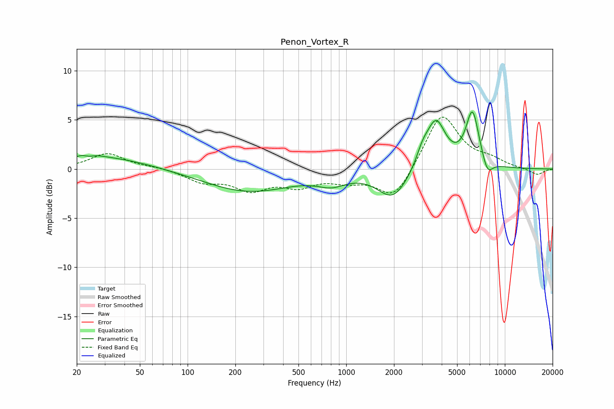

# Penon_Vortex_R
See [usage instructions](https://github.com/jaakkopasanen/AutoEq#usage) for more options and info.

### Parametric EQs
Apply preamp of -5.9 dB when using parametric equalizer.

|   # | Type    |   Fc (Hz) |    Q |   Gain (dB) |
|-----|---------|-----------|------|-------------|
|   1 | Peaking |        23 | 2.4  |         1.5 |
|   2 | Peaking |        24 | 3.36 |        -1   |
|   3 | Peaking |        33 | 0.55 |         1.1 |
|   4 | Peaking |       242 | 0.51 |        -2.3 |
|   5 | Peaking |       808 | 1.59 |        -1   |
|   6 | Peaking |      1974 | 1.47 |        -3   |
|   7 | Peaking |      3024 | 3.53 |         1.4 |
|   8 | Peaking |      3680 | 2.29 |         4.8 |
|   9 | Peaking |      6251 | 3.26 |         5.6 |
|  10 | Peaking |      7764 | 4.03 |        -1.6 |

### Fixed Band EQs
When using fixed band (also called graphic) equalizer, apply preamp of **-5.4 dB** (if available) and set gains manually with these parameters.

|   # | Type    |   Fc (Hz) |    Q |   Gain (dB) |
|-----|---------|-----------|------|-------------|
|   1 | Peaking |        31 | 1.41 |         1.6 |
|   2 | Peaking |        62 | 1.41 |         0.2 |
|   3 | Peaking |       125 | 1.41 |        -1.2 |
|   4 | Peaking |       250 | 1.41 |        -1.9 |
|   5 | Peaking |       500 | 1.41 |        -1.5 |
|   6 | Peaking |      1000 | 1.41 |        -1   |
|   7 | Peaking |      2000 | 1.41 |        -3.1 |
|   8 | Peaking |      4000 | 1.41 |         5.7 |
|   9 | Peaking |      8000 | 1.41 |         0.8 |
|  10 | Peaking |     16000 | 1.41 |        -0.6 |

### Graphs

