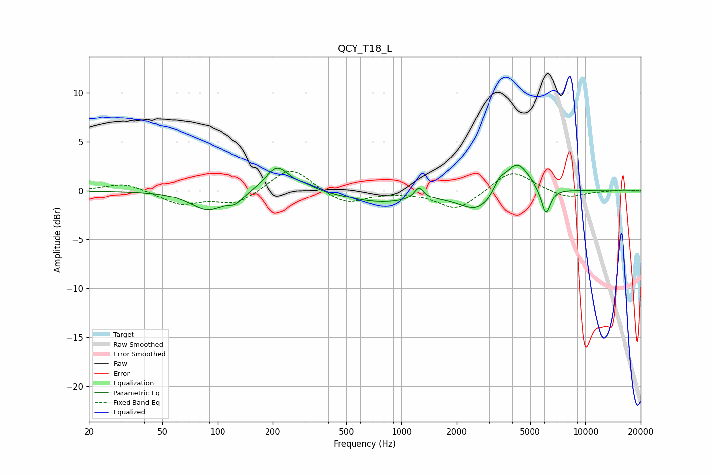

# QCY_T18_L
See [usage instructions](https://github.com/jaakkopasanen/AutoEq#usage) for more options and info.

### Parametric EQs
Apply preamp of -2.7 dB when using parametric equalizer.

|   # | Type    |   Fc (Hz) |    Q |   Gain (dB) |
|-----|---------|-----------|------|-------------|
|   1 | Peaking |        88 | 1.55 |        -1.9 |
|   2 | Peaking |       125 | 3.31 |        -0.9 |
|   3 | Peaking |       211 | 2.2  |         2.6 |
|   4 | Peaking |       302 | 2.29 |         0.4 |
|   5 | Peaking |       769 | 0.77 |        -1.1 |
|   6 | Peaking |      1245 | 5.84 |         1.2 |
|   7 | Peaking |      2606 | 1.41 |        -2.2 |
|   8 | Peaking |      3405 | 4.86 |         1   |
|   9 | Peaking |      4227 | 2    |         3.3 |
|  10 | Peaking |      6104 | 5.45 |        -2.8 |

### Fixed Band EQs
When using fixed band (also called graphic) equalizer, apply preamp of **-2.1 dB** (if available) and set gains manually with these parameters.

|   # | Type    |   Fc (Hz) |    Q |   Gain (dB) |
|-----|---------|-----------|------|-------------|
|   1 | Peaking |        31 | 1.41 |         0.9 |
|   2 | Peaking |        62 | 1.41 |        -1.4 |
|   3 | Peaking |       125 | 1.41 |        -1.4 |
|   4 | Peaking |       250 | 1.41 |         2.5 |
|   5 | Peaking |       500 | 1.41 |        -1.4 |
|   6 | Peaking |      1000 | 1.41 |         0   |
|   7 | Peaking |      2000 | 1.41 |        -2   |
|   8 | Peaking |      4000 | 1.41 |         2.2 |
|   9 | Peaking |      8000 | 1.41 |        -0.8 |
|  10 | Peaking |     16000 | 1.41 |         0.1 |

### Graphs

