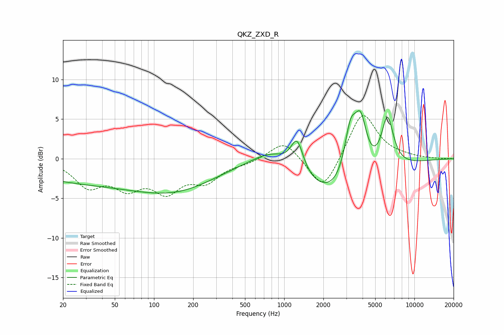

# QKZ_ZXD_R
See [usage instructions](https://github.com/jaakkopasanen/AutoEq#usage) for more options and info.

### Parametric EQs
Apply preamp of -6.2 dB when using parametric equalizer.

|   # | Type    |   Fc (Hz) |    Q |   Gain (dB) |
|-----|---------|-----------|------|-------------|
|   1 | Peaking |        44 | 0.2  |        -3.1 |
|   2 | Peaking |       163 | 0.48 |        -2   |
|   3 | Peaking |       825 | 0.89 |         2.4 |
|   4 | Peaking |      1235 | 2.76 |         1   |
|   5 | Peaking |      1239 | 2.08 |        -1.8 |
|   6 | Peaking |      1257 | 2.73 |         4.8 |
|   7 | Peaking |      2541 | 0.5  |        -5.3 |
|   8 | Peaking |      3225 | 2.95 |         6.3 |
|   9 | Peaking |      3865 | 2.9  |         6.7 |
|  10 | Peaking |      6207 | 2.92 |         6.6 |

### Fixed Band EQs
When using fixed band (also called graphic) equalizer, apply preamp of **-5.5 dB** (if available) and set gains manually with these parameters.

|   # | Type    |   Fc (Hz) |    Q |   Gain (dB) |
|-----|---------|-----------|------|-------------|
|   1 | Peaking |        31 | 1.41 |        -3.2 |
|   2 | Peaking |        62 | 1.41 |        -3.1 |
|   3 | Peaking |       125 | 1.41 |        -3.6 |
|   4 | Peaking |       250 | 1.41 |        -2.5 |
|   5 | Peaking |       500 | 1.41 |        -0.5 |
|   6 | Peaking |      1000 | 1.41 |         2.4 |
|   7 | Peaking |      2000 | 1.41 |        -4.4 |
|   8 | Peaking |      4000 | 1.41 |         6.1 |
|   9 | Peaking |      8000 | 1.41 |         0.2 |
|  10 | Peaking |     16000 | 1.41 |        -0   |

### Graphs

