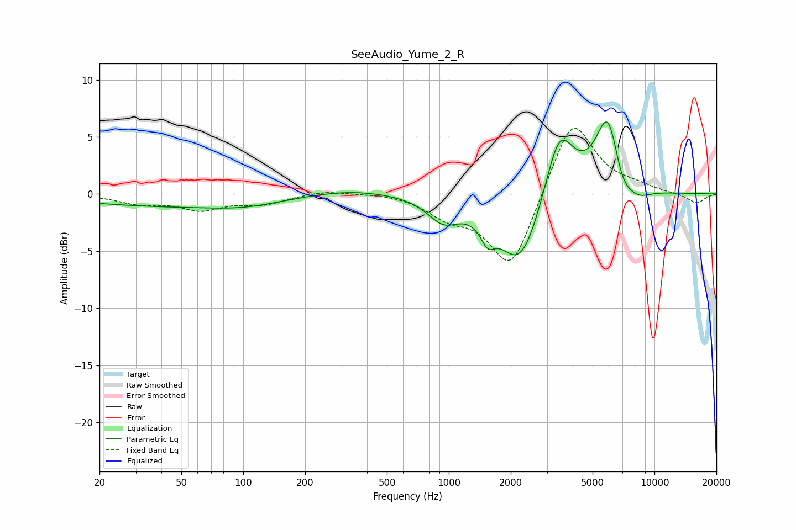

# SeeAudio_Yume_2_R
See [usage instructions](https://github.com/jaakkopasanen/AutoEq#usage) for more options and info.

### Parametric EQs
Apply preamp of -6.4 dB when using parametric equalizer.

|   # | Type    |   Fc (Hz) |    Q |   Gain (dB) |
|-----|---------|-----------|------|-------------|
|   1 | Peaking |        44 | 0.3  |        -1   |
|   2 | Peaking |       102 | 0.86 |        -0.5 |
|   3 | Peaking |       329 | 0.69 |         0.5 |
|   4 | Peaking |       939 | 1.85 |        -2   |
|   5 | Peaking |      1544 | 4.15 |        -1.7 |
|   6 | Peaking |      2228 | 1.33 |        -6.6 |
|   7 | Peaking |      3444 | 1.94 |         6.5 |
|   8 | Peaking |      5973 | 2.21 |         7.6 |
|   9 | Peaking |      6859 | 2.63 |        -2.5 |
|  10 | Peaking |      8297 | 2.01 |        -1   |

### Fixed Band EQs
When using fixed band (also called graphic) equalizer, apply preamp of **-5.9 dB** (if available) and set gains manually with these parameters.

|   # | Type    |   Fc (Hz) |    Q |   Gain (dB) |
|-----|---------|-----------|------|-------------|
|   1 | Peaking |        31 | 1.41 |        -0.7 |
|   2 | Peaking |        62 | 1.41 |        -1.2 |
|   3 | Peaking |       125 | 1.41 |        -0.8 |
|   4 | Peaking |       250 | 1.41 |         0.4 |
|   5 | Peaking |       500 | 1.41 |         0.2 |
|   6 | Peaking |      1000 | 1.41 |        -1.6 |
|   7 | Peaking |      2000 | 1.41 |        -6.7 |
|   8 | Peaking |      4000 | 1.41 |         6.9 |
|   9 | Peaking |      8000 | 1.41 |         0.5 |
|  10 | Peaking |     16000 | 1.41 |        -0.8 |

### Graphs

