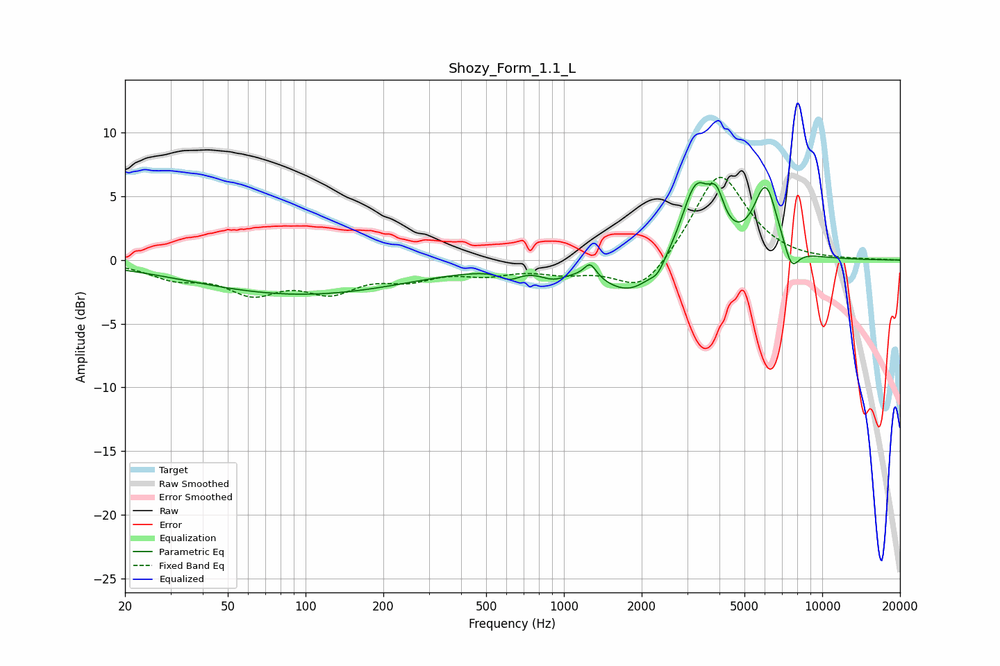

# Shozy_Form_1.1_L
See [usage instructions](https://github.com/jaakkopasanen/AutoEq#usage) for more options and info.

### Parametric EQs
Apply preamp of -6.2 dB when using parametric equalizer.

|   # | Type    |   Fc (Hz) |    Q |   Gain (dB) |
|-----|---------|-----------|------|-------------|
|   1 | Peaking |        96 | 0.33 |        -2.7 |
|   2 | Peaking |       616 | 3.61 |        -0.7 |
|   3 | Peaking |       908 | 2.76 |        -0.7 |
|   4 | Peaking |      1264 | 6    |         1.1 |
|   5 | Peaking |      1818 | 1.26 |        -2.7 |
|   6 | Peaking |      2308 | 5.41 |        -0.7 |
|   7 | Peaking |      3240 | 2.41 |         5.9 |
|   8 | Peaking |      3896 | 4.68 |         2.6 |
|   9 | Peaking |      6042 | 2.93 |         5.5 |
|  10 | Peaking |      7599 | 4.63 |        -1.9 |

### Fixed Band EQs
When using fixed band (also called graphic) equalizer, apply preamp of **-6.6 dB** (if available) and set gains manually with these parameters.

|   # | Type    |   Fc (Hz) |    Q |   Gain (dB) |
|-----|---------|-----------|------|-------------|
|   1 | Peaking |        31 | 1.41 |        -1.2 |
|   2 | Peaking |        62 | 1.41 |        -2.3 |
|   3 | Peaking |       125 | 1.41 |        -2.1 |
|   4 | Peaking |       250 | 1.41 |        -1.2 |
|   5 | Peaking |       500 | 1.41 |        -0.9 |
|   6 | Peaking |      1000 | 1.41 |        -0.8 |
|   7 | Peaking |      2000 | 1.41 |        -2.7 |
|   8 | Peaking |      4000 | 1.41 |         7   |
|   9 | Peaking |      8000 | 1.41 |        -0.1 |
|  10 | Peaking |     16000 | 1.41 |         0   |

### Graphs

