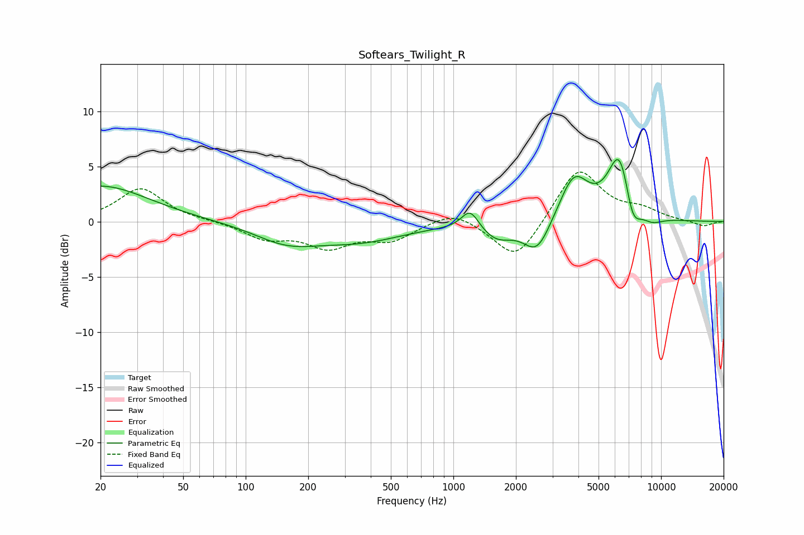

# Softears_Twilight_R
See [usage instructions](https://github.com/jaakkopasanen/AutoEq#usage) for more options and info.

### Parametric EQs
Apply preamp of -5.7 dB when using parametric equalizer.

|   # | Type    |   Fc (Hz) |    Q |   Gain (dB) |
|-----|---------|-----------|------|-------------|
|   1 | Peaking |        20 | 0.62 |         3.3 |
|   2 | Peaking |       158 | 0.9  |        -1.6 |
|   3 | Peaking |       357 | 0.65 |        -1.6 |
|   4 | Peaking |      1203 | 3.44 |         1.8 |
|   5 | Peaking |      1620 | 1.88 |        -1.4 |
|   6 | Peaking |      2529 | 2.15 |        -3   |
|   7 | Peaking |      3805 | 1.99 |         4.1 |
|   8 | Peaking |      6338 | 2.38 |         6.5 |
|   9 | Peaking |      7262 | 3.4  |        -3.1 |
|  10 | Peaking |      9018 | 2.39 |        -0.7 |

### Fixed Band EQs
When using fixed band (also called graphic) equalizer, apply preamp of **-4.6 dB** (if available) and set gains manually with these parameters.

|   # | Type    |   Fc (Hz) |    Q |   Gain (dB) |
|-----|---------|-----------|------|-------------|
|   1 | Peaking |        31 | 1.41 |         3   |
|   2 | Peaking |        62 | 1.41 |         0.1 |
|   3 | Peaking |       125 | 1.41 |        -1.4 |
|   4 | Peaking |       250 | 1.41 |        -2.1 |
|   5 | Peaking |       500 | 1.41 |        -1.5 |
|   6 | Peaking |      1000 | 1.41 |         1.2 |
|   7 | Peaking |      2000 | 1.41 |        -3.7 |
|   8 | Peaking |      4000 | 1.41 |         5   |
|   9 | Peaking |      8000 | 1.41 |         0.9 |
|  10 | Peaking |     16000 | 1.41 |        -0.5 |

### Graphs

