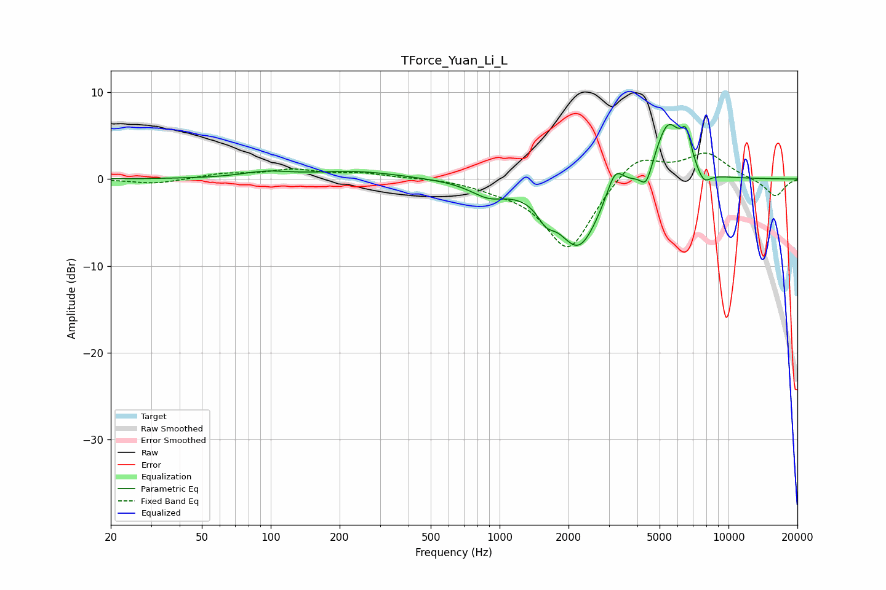

# TForce_Yuan_Li_L
See [usage instructions](https://github.com/jaakkopasanen/AutoEq#usage) for more options and info.

### Parametric EQs
Apply preamp of -6.4 dB when using parametric equalizer.

|   # | Type    |   Fc (Hz) |    Q |   Gain (dB) |
|-----|---------|-----------|------|-------------|
|   1 | Peaking |        95 | 1.37 |         0.7 |
|   2 | Peaking |       236 | 0.73 |         0.9 |
|   3 | Peaking |       893 | 1.8  |        -1.5 |
|   4 | Peaking |      1592 | 3.86 |        -1.7 |
|   5 | Peaking |      2217 | 1.51 |        -7.9 |
|   6 | Peaking |      3194 | 3.77 |         3.3 |
|   7 | Peaking |      4375 | 5.54 |        -2.3 |
|   8 | Peaking |      5438 | 2.35 |         6.7 |
|   9 | Peaking |      6535 | 5.81 |         3.3 |
|  10 | Peaking |      7782 | 4.23 |        -1.6 |

### Fixed Band EQs
When using fixed band (also called graphic) equalizer, apply preamp of **-3.1 dB** (if available) and set gains manually with these parameters.

|   # | Type    |   Fc (Hz) |    Q |   Gain (dB) |
|-----|---------|-----------|------|-------------|
|   1 | Peaking |        31 | 1.41 |        -0.6 |
|   2 | Peaking |        62 | 1.41 |         0.6 |
|   3 | Peaking |       125 | 1.41 |         1   |
|   4 | Peaking |       250 | 1.41 |         0.6 |
|   5 | Peaking |       500 | 1.41 |         0.2 |
|   6 | Peaking |      1000 | 1.41 |        -0.7 |
|   7 | Peaking |      2000 | 1.41 |        -8.3 |
|   8 | Peaking |      4000 | 1.41 |         3.1 |
|   9 | Peaking |      8000 | 1.41 |         2.9 |
|  10 | Peaking |     16000 | 1.41 |        -2.1 |

### Graphs

