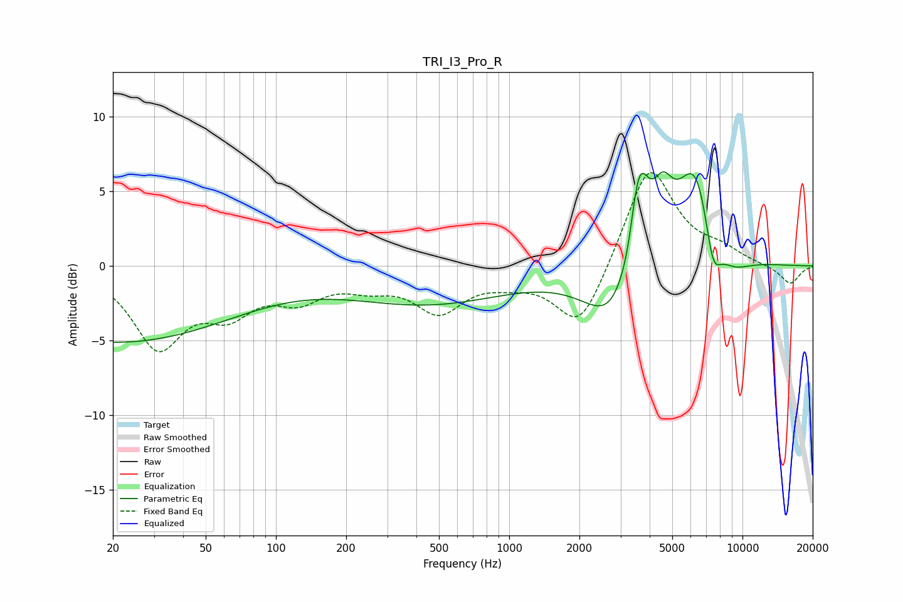

# TRI_I3_Pro_R
See [usage instructions](https://github.com/jaakkopasanen/AutoEq#usage) for more options and info.

### Parametric EQs
Apply preamp of -6.4 dB when using parametric equalizer.

|   # | Type    |   Fc (Hz) |    Q |   Gain (dB) |
|-----|---------|-----------|------|-------------|
|   1 | Peaking |        20 | 0.26 |        -5.1 |
|   2 | Peaking |       448 | 0.41 |        -2.4 |
|   3 | Peaking |      2861 | 1.16 |        -4.4 |
|   4 | Peaking |      3321 | 4.26 |        -2.2 |
|   5 | Peaking |      3448 | 3.81 |         2.8 |
|   6 | Peaking |      3620 | 2.94 |         6.1 |
|   7 | Peaking |      4555 | 3.04 |         3.3 |
|   8 | Peaking |      6320 | 1.59 |         7.4 |
|   9 | Peaking |      7459 | 3.63 |        -3.5 |
|  10 | Peaking |      8832 | 1.54 |        -1.6 |

### Fixed Band EQs
When using fixed band (also called graphic) equalizer, apply preamp of **-6.3 dB** (if available) and set gains manually with these parameters.

|   # | Type    |   Fc (Hz) |    Q |   Gain (dB) |
|-----|---------|-----------|------|-------------|
|   1 | Peaking |        31 | 1.41 |        -5.2 |
|   2 | Peaking |        62 | 1.41 |        -2.6 |
|   3 | Peaking |       125 | 1.41 |        -1.8 |
|   4 | Peaking |       250 | 1.41 |        -1   |
|   5 | Peaking |       500 | 1.41 |        -2.8 |
|   6 | Peaking |      1000 | 1.41 |        -0.7 |
|   7 | Peaking |      2000 | 1.41 |        -4.4 |
|   8 | Peaking |      4000 | 1.41 |         6.9 |
|   9 | Peaking |      8000 | 1.41 |         0.9 |
|  10 | Peaking |     16000 | 1.41 |        -1.3 |

### Graphs

