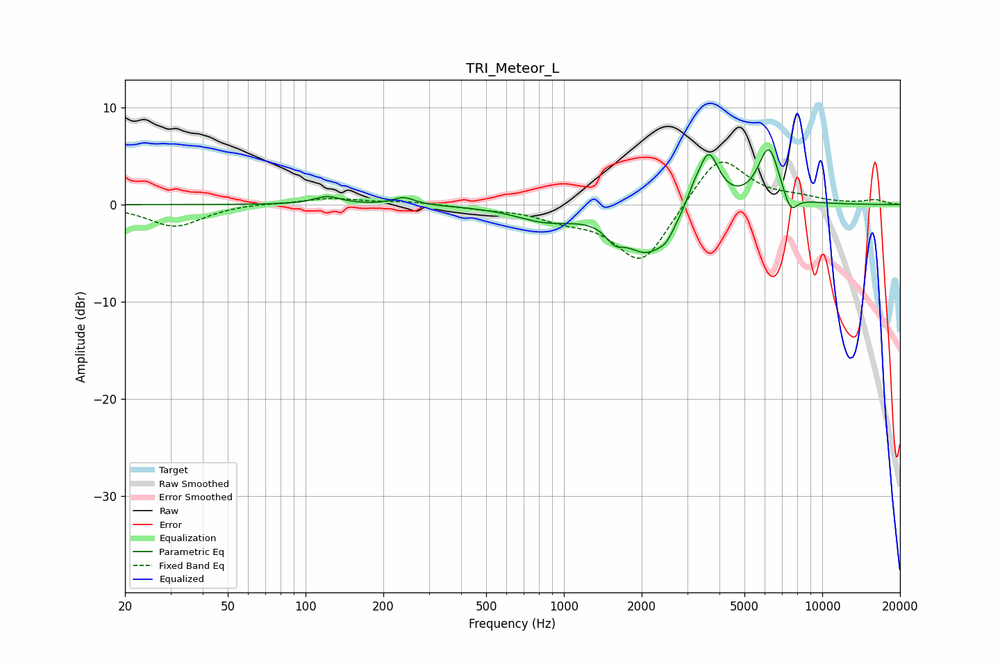

# TRI_Meteor_L
See [usage instructions](https://github.com/jaakkopasanen/AutoEq#usage) for more options and info.

### Parametric EQs
Apply preamp of -5.7 dB when using parametric equalizer.

|   # | Type    |   Fc (Hz) |    Q |   Gain (dB) |
|-----|---------|-----------|------|-------------|
|   1 | Peaking |       121 | 2.74 |         0.8 |
|   2 | Peaking |       240 | 3.4  |         0.8 |
|   3 | Peaking |       854 | 1.18 |        -1.5 |
|   4 | Peaking |      1572 | 4.17 |        -1.4 |
|   5 | Peaking |      2106 | 1.55 |        -4.8 |
|   6 | Peaking |      2494 | 5.07 |        -0.9 |
|   7 | Peaking |      3162 | 5.47 |         0.9 |
|   8 | Peaking |      3624 | 3.34 |         5.8 |
|   9 | Peaking |      6211 | 3.22 |         5.9 |
|  10 | Peaking |      7525 | 4.89 |        -2.1 |

### Fixed Band EQs
When using fixed band (also called graphic) equalizer, apply preamp of **-4.5 dB** (if available) and set gains manually with these parameters.

|   # | Type    |   Fc (Hz) |    Q |   Gain (dB) |
|-----|---------|-----------|------|-------------|
|   1 | Peaking |        31 | 1.41 |        -2.3 |
|   2 | Peaking |        62 | 1.41 |         0.2 |
|   3 | Peaking |       125 | 1.41 |         0.6 |
|   4 | Peaking |       250 | 1.41 |         0.3 |
|   5 | Peaking |       500 | 1.41 |        -0.3 |
|   6 | Peaking |      1000 | 1.41 |        -1.2 |
|   7 | Peaking |      2000 | 1.41 |        -6.2 |
|   8 | Peaking |      4000 | 1.41 |         5.4 |
|   9 | Peaking |      8000 | 1.41 |         0.5 |
|  10 | Peaking |     16000 | 1.41 |         0.4 |

### Graphs

