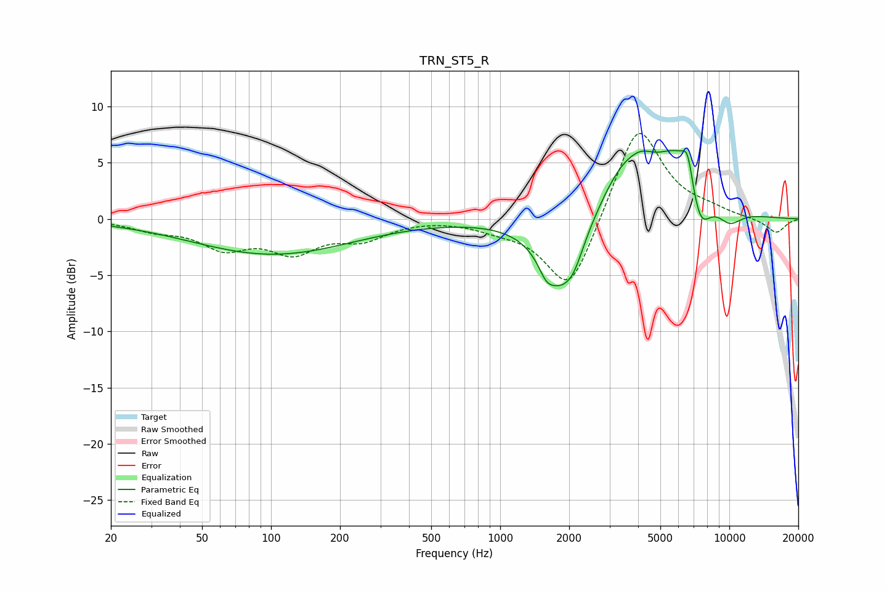

# TRN_ST5_R
See [usage instructions](https://github.com/jaakkopasanen/AutoEq#usage) for more options and info.

### Parametric EQs
Apply preamp of -6.2 dB when using parametric equalizer.

|   # | Type    |   Fc (Hz) |    Q |   Gain (dB) |
|-----|---------|-----------|------|-------------|
|   1 | Peaking |       101 | 0.41 |        -3.1 |
|   2 | Peaking |      1590 | 4.42 |        -1.2 |
|   3 | Peaking |      1864 | 1.53 |        -6.4 |
|   4 | Peaking |      2106 | 3.81 |        -0.9 |
|   5 | Peaking |      3474 | 1.23 |         4.4 |
|   6 | Peaking |      4169 | 2.8  |         0.8 |
|   7 | Peaking |      6169 | 1.22 |         6.1 |
|   8 | Peaking |      6579 | 6    |         2.3 |
|   9 | Peaking |      7415 | 2.63 |        -4.9 |
|  10 | Peaking |     10000 | 2.22 |        -1.5 |

### Fixed Band EQs
When using fixed band (also called graphic) equalizer, apply preamp of **-7.7 dB** (if available) and set gains manually with these parameters.

|   # | Type    |   Fc (Hz) |    Q |   Gain (dB) |
|-----|---------|-----------|------|-------------|
|   1 | Peaking |        31 | 1.41 |        -0.8 |
|   2 | Peaking |        62 | 1.41 |        -2.3 |
|   3 | Peaking |       125 | 1.41 |        -2.6 |
|   4 | Peaking |       250 | 1.41 |        -1.6 |
|   5 | Peaking |       500 | 1.41 |         0.1 |
|   6 | Peaking |      1000 | 1.41 |        -0.6 |
|   7 | Peaking |      2000 | 1.41 |        -6.8 |
|   8 | Peaking |      4000 | 1.41 |         8.8 |
|   9 | Peaking |      8000 | 1.41 |         0.6 |
|  10 | Peaking |     16000 | 1.41 |        -1.3 |

### Graphs

