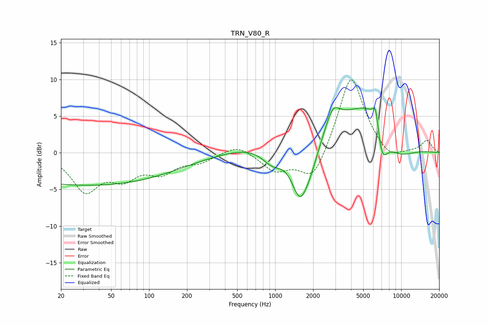

# TRN_V80_R
See [usage instructions](https://github.com/jaakkopasanen/AutoEq#usage) for more options and info.

### Parametric EQs
Apply preamp of -6.3 dB when using parametric equalizer.

|   # | Type    |   Fc (Hz) |    Q |   Gain (dB) |
|-----|---------|-----------|------|-------------|
|   1 | Peaking |        32 | 0.18 |        -4.4 |
|   2 | Peaking |       959 | 1.5  |        -3   |
|   3 | Peaking |      1569 | 1.88 |        -7.5 |
|   4 | Peaking |      1909 | 1.66 |        -3.6 |
|   5 | Peaking |      2857 | 0.29 |         5.3 |
|   6 | Peaking |      2866 | 2.68 |         2.6 |
|   7 | Peaking |      6145 | 1.02 |         4.6 |
|   8 | Peaking |      6276 | 5.61 |         3.3 |
|   9 | Peaking |      6992 | 2.64 |        -5.8 |
|  10 | Peaking |      9057 | 0.91 |        -3.5 |

### Fixed Band EQs
When using fixed band (also called graphic) equalizer, apply preamp of **-10.0 dB** (if available) and set gains manually with these parameters.

|   # | Type    |   Fc (Hz) |    Q |   Gain (dB) |
|-----|---------|-----------|------|-------------|
|   1 | Peaking |        31 | 1.41 |        -5   |
|   2 | Peaking |        62 | 1.41 |        -2.9 |
|   3 | Peaking |       125 | 1.41 |        -2.4 |
|   4 | Peaking |       250 | 1.41 |        -1.1 |
|   5 | Peaking |       500 | 1.41 |         1.2 |
|   6 | Peaking |      1000 | 1.41 |        -2.4 |
|   7 | Peaking |      2000 | 1.41 |        -4.3 |
|   8 | Peaking |      4000 | 1.41 |        11   |
|   9 | Peaking |      8000 | 1.41 |        -1.5 |
|  10 | Peaking |     16000 | 1.41 |         1.6 |

### Graphs

