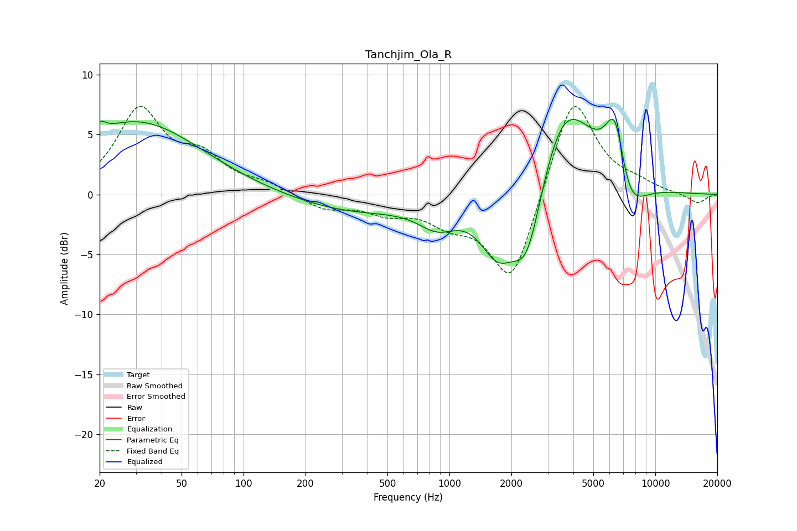

# Tanchjim_Ola_R
See [usage instructions](https://github.com/jaakkopasanen/AutoEq#usage) for more options and info.

### Parametric EQs
Apply preamp of -6.4 dB when using parametric equalizer.

|   # | Type    |   Fc (Hz) |    Q |   Gain (dB) |
|-----|---------|-----------|------|-------------|
|   1 | Peaking |        20 | 5.94 |         0.8 |
|   2 | Peaking |        30 | 0.45 |         6.1 |
|   3 | Peaking |       340 | 0.47 |        -1.4 |
|   4 | Peaking |       875 | 1.49 |        -1.9 |
|   5 | Peaking |      1711 | 1.6  |        -4.7 |
|   6 | Peaking |      2386 | 1.79 |        -7.1 |
|   7 | Peaking |      3479 | 1.71 |         0.7 |
|   8 | Peaking |      3653 | 0.91 |         7.9 |
|   9 | Peaking |      6397 | 2.68 |         6.6 |
|  10 | Peaking |      7276 | 1.69 |        -4.5 |

### Fixed Band EQs
When using fixed band (also called graphic) equalizer, apply preamp of **-7.5 dB** (if available) and set gains manually with these parameters.

|   # | Type    |   Fc (Hz) |    Q |   Gain (dB) |
|-----|---------|-----------|------|-------------|
|   1 | Peaking |        31 | 1.41 |         6.9 |
|   2 | Peaking |        62 | 1.41 |         2.6 |
|   3 | Peaking |       125 | 1.41 |         0.7 |
|   4 | Peaking |       250 | 1.41 |        -1.2 |
|   5 | Peaking |       500 | 1.41 |        -1.3 |
|   6 | Peaking |      1000 | 1.41 |        -1.8 |
|   7 | Peaking |      2000 | 1.41 |        -7.7 |
|   8 | Peaking |      4000 | 1.41 |         8.7 |
|   9 | Peaking |      8000 | 1.41 |         0.7 |
|  10 | Peaking |     16000 | 1.41 |        -0.8 |

### Graphs

