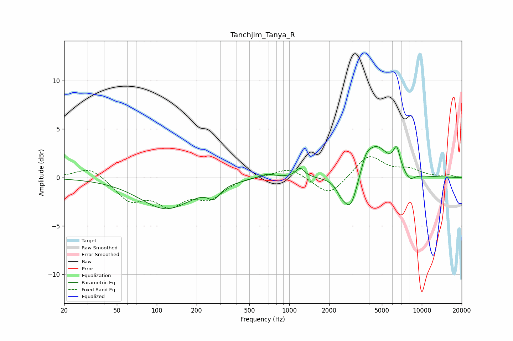

# Tanchjim_Tanya_R
See [usage instructions](https://github.com/jaakkopasanen/AutoEq#usage) for more options and info.

### Parametric EQs
Apply preamp of -3.3 dB when using parametric equalizer.

|   # | Type    |   Fc (Hz) |    Q |   Gain (dB) |
|-----|---------|-----------|------|-------------|
|   1 | Peaking |       117 | 0.72 |        -3.2 |
|   2 | Peaking |       271 | 3.2  |        -1.2 |
|   3 | Peaking |       676 | 2.16 |         0.5 |
|   4 | Peaking |      1209 | 4.29 |         1   |
|   5 | Peaking |      2443 | 4.52 |        -0.7 |
|   6 | Peaking |      2891 | 2.56 |        -3.8 |
|   7 | Peaking |      3788 | 3.98 |         1   |
|   8 | Peaking |      4502 | 1.5  |         3.4 |
|   9 | Peaking |      6465 | 5.24 |         2.1 |
|  10 | Peaking |      8094 | 3.46 |        -0.8 |

### Fixed Band EQs
When using fixed band (also called graphic) equalizer, apply preamp of **-2.2 dB** (if available) and set gains manually with these parameters.

|   # | Type    |   Fc (Hz) |    Q |   Gain (dB) |
|-----|---------|-----------|------|-------------|
|   1 | Peaking |        31 | 1.41 |         1.2 |
|   2 | Peaking |        62 | 1.41 |        -2.2 |
|   3 | Peaking |       125 | 1.41 |        -2.5 |
|   4 | Peaking |       250 | 1.41 |        -1.9 |
|   5 | Peaking |       500 | 1.41 |         0.1 |
|   6 | Peaking |      1000 | 1.41 |         1.1 |
|   7 | Peaking |      2000 | 1.41 |        -2   |
|   8 | Peaking |      4000 | 1.41 |         2.3 |
|   9 | Peaking |      8000 | 1.41 |         0.7 |
|  10 | Peaking |     16000 | 1.41 |         0.2 |

### Graphs

