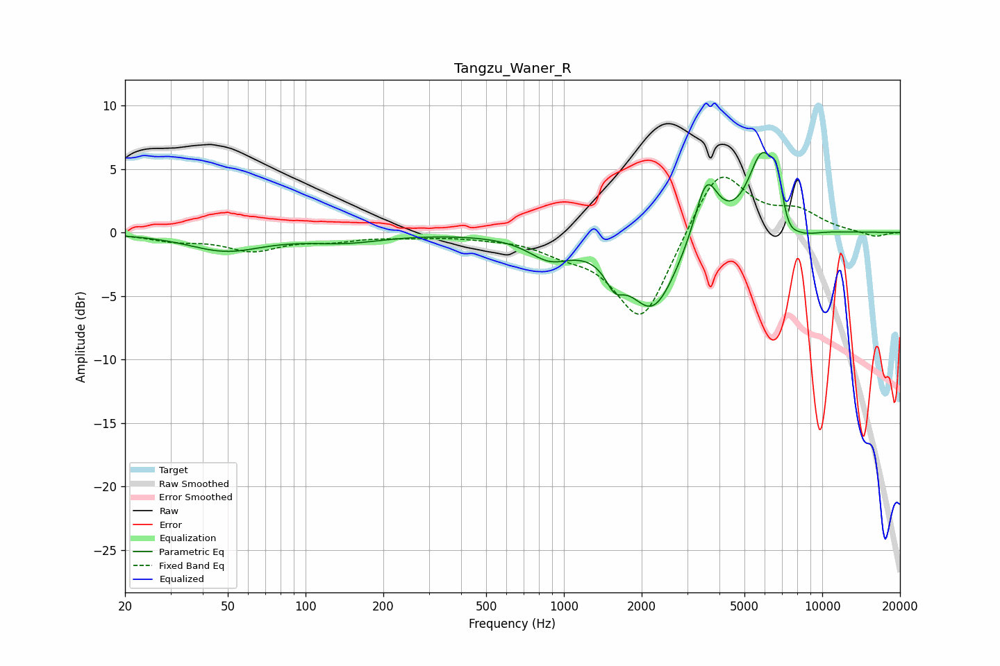

# Tangzu_Waner_R
See [usage instructions](https://github.com/jaakkopasanen/AutoEq#usage) for more options and info.

### Parametric EQs
Apply preamp of -6.4 dB when using parametric equalizer.

|   # | Type    |   Fc (Hz) |    Q |   Gain (dB) |
|-----|---------|-----------|------|-------------|
|   1 | Peaking |        49 | 0.98 |        -1.4 |
|   2 | Peaking |       143 | 0.95 |        -0.7 |
|   3 | Peaking |       881 | 1.72 |        -1.6 |
|   4 | Peaking |      1571 | 4.01 |        -1.7 |
|   5 | Peaking |      2212 | 1.46 |        -6.1 |
|   6 | Peaking |      3559 | 3.02 |         5   |
|   7 | Peaking |      5853 | 2.44 |         6.2 |
|   8 | Peaking |      6671 | 6    |         2.6 |
|   9 | Peaking |      7364 | 3.99 |        -1.4 |
|  10 | Peaking |      8343 | 1.96 |        -0.7 |

### Fixed Band EQs
When using fixed band (also called graphic) equalizer, apply preamp of **-4.5 dB** (if available) and set gains manually with these parameters.

|   # | Type    |   Fc (Hz) |    Q |   Gain (dB) |
|-----|---------|-----------|------|-------------|
|   1 | Peaking |        31 | 1.41 |        -0.6 |
|   2 | Peaking |        62 | 1.41 |        -1.3 |
|   3 | Peaking |       125 | 1.41 |        -0.5 |
|   4 | Peaking |       250 | 1.41 |        -0.2 |
|   5 | Peaking |       500 | 1.41 |        -0.2 |
|   6 | Peaking |      1000 | 1.41 |        -1.1 |
|   7 | Peaking |      2000 | 1.41 |        -7.2 |
|   8 | Peaking |      4000 | 1.41 |         5.4 |
|   9 | Peaking |      8000 | 1.41 |         1.5 |
|  10 | Peaking |     16000 | 1.41 |        -0.4 |

### Graphs

