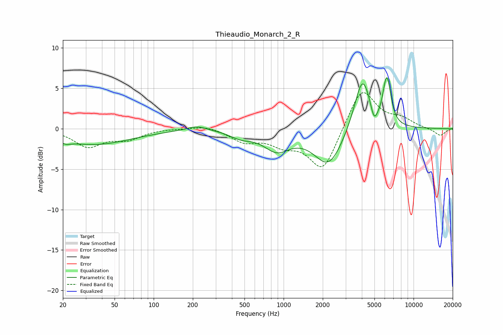

# Thieaudio_Monarch_2_R
See [usage instructions](https://github.com/jaakkopasanen/AutoEq#usage) for more options and info.

### Parametric EQs
Apply preamp of -6.4 dB when using parametric equalizer.

|   # | Type    |   Fc (Hz) |    Q |   Gain (dB) |
|-----|---------|-----------|------|-------------|
|   1 | Peaking |        21 | 4    |        -0.4 |
|   2 | Peaking |        34 | 0.49 |        -1.9 |
|   3 | Peaking |       215 | 1.78 |         0.6 |
|   4 | Peaking |       470 | 1.62 |        -0.8 |
|   5 | Peaking |       885 | 1.41 |        -2.4 |
|   6 | Peaking |      2222 | 1.28 |        -4.6 |
|   7 | Peaking |      4049 | 2.17 |         6.9 |
|   8 | Peaking |      4968 | 5.16 |        -2   |
|   9 | Peaking |      6139 | 5.24 |         3.6 |
|  10 | Peaking |      6403 | 4.96 |         2.3 |

### Fixed Band EQs
When using fixed band (also called graphic) equalizer, apply preamp of **-4.6 dB** (if available) and set gains manually with these parameters.

|   # | Type    |   Fc (Hz) |    Q |   Gain (dB) |
|-----|---------|-----------|------|-------------|
|   1 | Peaking |        31 | 1.41 |        -2.1 |
|   2 | Peaking |        62 | 1.41 |        -1.2 |
|   3 | Peaking |       125 | 1.41 |         0   |
|   4 | Peaking |       250 | 1.41 |         0.5 |
|   5 | Peaking |       500 | 1.41 |        -1.5 |
|   6 | Peaking |      1000 | 1.41 |        -1.6 |
|   7 | Peaking |      2000 | 1.41 |        -5.3 |
|   8 | Peaking |      4000 | 1.41 |         5.3 |
|   9 | Peaking |      8000 | 1.41 |         1   |
|  10 | Peaking |     16000 | 1.41 |        -0.9 |

### Graphs

