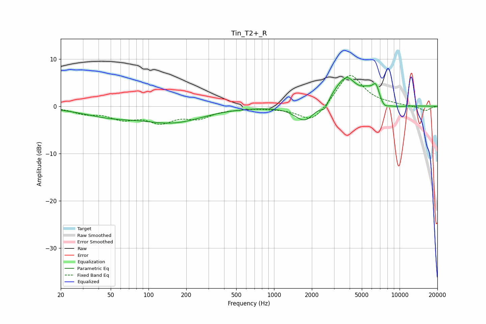

# Tin_T2+_R
See [usage instructions](https://github.com/jaakkopasanen/AutoEq#usage) for more options and info.

### Parametric EQs
Apply preamp of -6.1 dB when using parametric equalizer.

|   # | Type    |   Fc (Hz) |    Q |   Gain (dB) |
|-----|---------|-----------|------|-------------|
|   1 | Peaking |        50 | 0.61 |        -1.9 |
|   2 | Peaking |       160 | 0.6  |        -3.1 |
|   3 | Peaking |      1763 | 1.75 |        -3.6 |
|   4 | Peaking |      2526 | 4.8  |        -1.8 |
|   5 | Peaking |      3669 | 1.39 |         5.6 |
|   6 | Peaking |      3880 | 3.37 |         0.7 |
|   7 | Peaking |      5505 | 3.01 |         1.5 |
|   8 | Peaking |      6478 | 4.44 |         3.4 |
|   9 | Peaking |      7489 | 3.52 |        -1.4 |
|  10 | Peaking |      9528 | 1.8  |        -0.4 |

### Fixed Band EQs
When using fixed band (also called graphic) equalizer, apply preamp of **-6.6 dB** (if available) and set gains manually with these parameters.

|   # | Type    |   Fc (Hz) |    Q |   Gain (dB) |
|-----|---------|-----------|------|-------------|
|   1 | Peaking |        31 | 1.41 |        -1.3 |
|   2 | Peaking |        62 | 1.41 |        -2.3 |
|   3 | Peaking |       125 | 1.41 |        -2.9 |
|   4 | Peaking |       250 | 1.41 |        -2.2 |
|   5 | Peaking |       500 | 1.41 |        -0.3 |
|   6 | Peaking |      1000 | 1.41 |        -0.3 |
|   7 | Peaking |      2000 | 1.41 |        -3.6 |
|   8 | Peaking |      4000 | 1.41 |         7.1 |
|   9 | Peaking |      8000 | 1.41 |         0.3 |
|  10 | Peaking |     16000 | 1.41 |        -1   |

### Graphs

