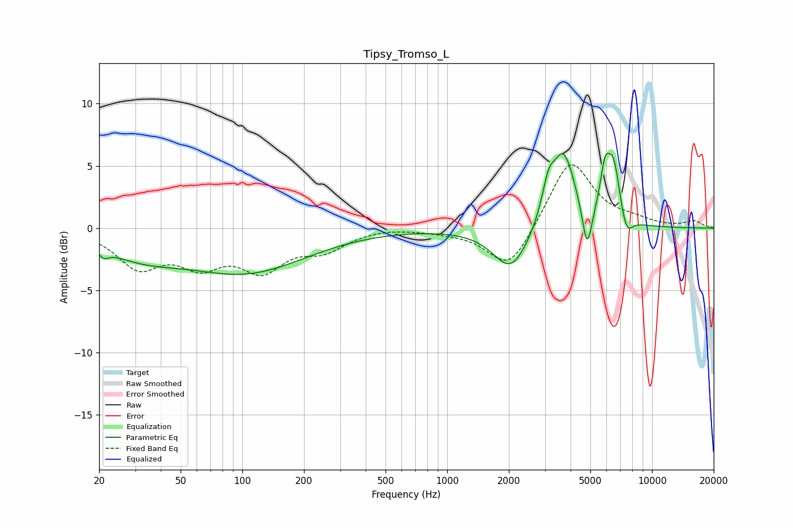

# Tipsy_Tromso_L
See [usage instructions](https://github.com/jaakkopasanen/AutoEq#usage) for more options and info.

### Parametric EQs
Apply preamp of -6.1 dB when using parametric equalizer.

|   # | Type    |   Fc (Hz) |    Q |   Gain (dB) |
|-----|---------|-----------|------|-------------|
|   1 | Peaking |        21 | 6    |        -0.6 |
|   2 | Peaking |        31 | 0.72 |        -1.8 |
|   3 | Peaking |       105 | 0.48 |        -3.4 |
|   4 | Peaking |      2052 | 1.64 |        -3.5 |
|   5 | Peaking |      3117 | 4.64 |         2.4 |
|   6 | Peaking |      3696 | 2.41 |         6.1 |
|   7 | Peaking |      4822 | 5.94 |        -3.7 |
|   8 | Peaking |      5897 | 5.58 |         3.4 |
|   9 | Peaking |      6499 | 4.38 |         4.4 |
|  10 | Peaking |      7508 | 4.85 |        -1.6 |

### Fixed Band EQs
When using fixed band (also called graphic) equalizer, apply preamp of **-5.2 dB** (if available) and set gains manually with these parameters.

|   # | Type    |   Fc (Hz) |    Q |   Gain (dB) |
|-----|---------|-----------|------|-------------|
|   1 | Peaking |        31 | 1.41 |        -2.9 |
|   2 | Peaking |        62 | 1.41 |        -2.5 |
|   3 | Peaking |       125 | 1.41 |        -3   |
|   4 | Peaking |       250 | 1.41 |        -1.5 |
|   5 | Peaking |       500 | 1.41 |         0.1 |
|   6 | Peaking |      1000 | 1.41 |        -0.2 |
|   7 | Peaking |      2000 | 1.41 |        -3.5 |
|   8 | Peaking |      4000 | 1.41 |         5.6 |
|   9 | Peaking |      8000 | 1.41 |         0.5 |
|  10 | Peaking |     16000 | 1.41 |         0.5 |

### Graphs

