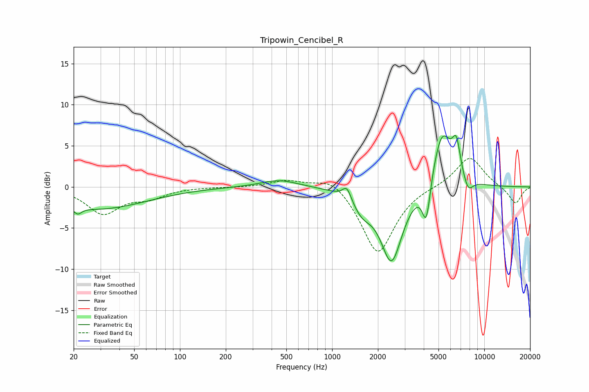

# Tripowin_Cencibel_R
See [usage instructions](https://github.com/jaakkopasanen/AutoEq#usage) for more options and info.

### Parametric EQs
Apply preamp of -6.3 dB when using parametric equalizer.

|   # | Type    |   Fc (Hz) |    Q |   Gain (dB) |
|-----|---------|-----------|------|-------------|
|   1 | Peaking |        21 | 5.74 |        -0.8 |
|   2 | Peaking |        29 | 0.44 |        -2.7 |
|   3 | Peaking |       450 | 1.16 |         0.9 |
|   4 | Peaking |      1250 | 4.98 |         1.6 |
|   5 | Peaking |      1574 | 2.26 |        -2   |
|   6 | Peaking |      2456 | 1.93 |        -9   |
|   7 | Peaking |      4160 | 5.17 |        -5.2 |
|   8 | Peaking |      5276 | 2.09 |         7.1 |
|   9 | Peaking |      6552 | 5.09 |         3.8 |
|  10 | Peaking |      7813 | 4.16 |        -1.8 |

### Fixed Band EQs
When using fixed band (also called graphic) equalizer, apply preamp of **-3.5 dB** (if available) and set gains manually with these parameters.

|   # | Type    |   Fc (Hz) |    Q |   Gain (dB) |
|-----|---------|-----------|------|-------------|
|   1 | Peaking |        31 | 1.41 |        -3.2 |
|   2 | Peaking |        62 | 1.41 |        -1.1 |
|   3 | Peaking |       125 | 1.41 |        -0   |
|   4 | Peaking |       250 | 1.41 |        -0   |
|   5 | Peaking |       500 | 1.41 |         0.8 |
|   6 | Peaking |      1000 | 1.41 |         1.5 |
|   7 | Peaking |      2000 | 1.41 |        -8.2 |
|   8 | Peaking |      4000 | 1.41 |         0.1 |
|   9 | Peaking |      8000 | 1.41 |         3.8 |
|  10 | Peaking |     16000 | 1.41 |        -2.1 |

### Graphs

