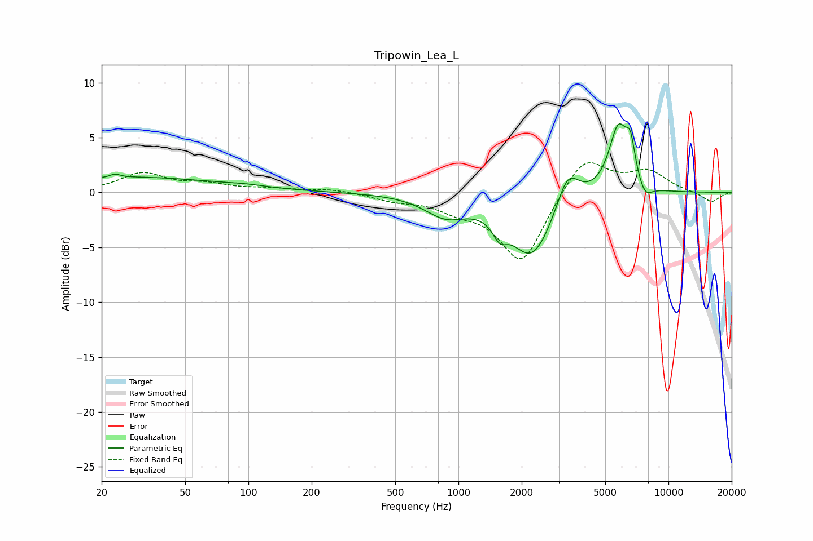

# Tripowin_Lea_L
See [usage instructions](https://github.com/jaakkopasanen/AutoEq#usage) for more options and info.

### Parametric EQs
Apply preamp of -6.4 dB when using parametric equalizer.

|   # | Type    |   Fc (Hz) |    Q |   Gain (dB) |
|-----|---------|-----------|------|-------------|
|   1 | Peaking |        23 | 5.86 |         0.3 |
|   2 | Peaking |        28 | 0.35 |         1.4 |
|   3 | Peaking |        98 | 1.27 |         0.2 |
|   4 | Peaking |       868 | 1.42 |        -1.8 |
|   5 | Peaking |      1572 | 4.34 |        -1.5 |
|   6 | Peaking |      2244 | 1.35 |        -5.9 |
|   7 | Peaking |      3313 | 2.6  |         3.4 |
|   8 | Peaking |      5772 | 3    |         6   |
|   9 | Peaking |      6592 | 6    |         3   |
|  10 | Peaking |      7727 | 3.96 |        -1.3 |

### Fixed Band EQs
When using fixed band (also called graphic) equalizer, apply preamp of **-2.8 dB** (if available) and set gains manually with these parameters.

|   # | Type    |   Fc (Hz) |    Q |   Gain (dB) |
|-----|---------|-----------|------|-------------|
|   1 | Peaking |        31 | 1.41 |         1.7 |
|   2 | Peaking |        62 | 1.41 |         0.6 |
|   3 | Peaking |       125 | 1.41 |         0.3 |
|   4 | Peaking |       250 | 1.41 |         0.3 |
|   5 | Peaking |       500 | 1.41 |        -0.6 |
|   6 | Peaking |      1000 | 1.41 |        -1.2 |
|   7 | Peaking |      2000 | 1.41 |        -6.4 |
|   8 | Peaking |      4000 | 1.41 |         3.5 |
|   9 | Peaking |      8000 | 1.41 |         1.8 |
|  10 | Peaking |     16000 | 1.41 |        -0.9 |

### Graphs

