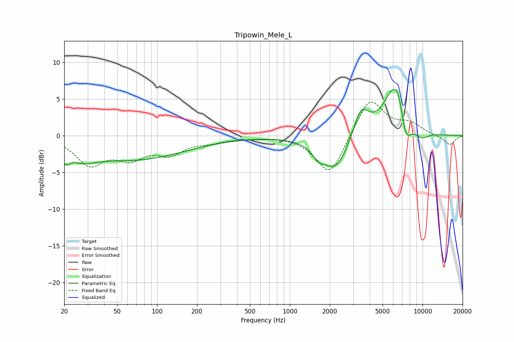

# Tripowin_Mele_L
See [usage instructions](https://github.com/jaakkopasanen/AutoEq#usage) for more options and info.

### Parametric EQs
Apply preamp of -6.4 dB when using parametric equalizer.

|   # | Type    |   Fc (Hz) |    Q |   Gain (dB) |
|-----|---------|-----------|------|-------------|
|   1 | Peaking |        20 | 4.49 |        -1.4 |
|   2 | Peaking |        27 | 1.4  |        -1.5 |
|   3 | Peaking |        66 | 0.35 |        -3.2 |
|   4 | Peaking |      1632 | 3.59 |        -1.1 |
|   5 | Peaking |      2205 | 1.37 |        -4.9 |
|   6 | Peaking |      3436 | 2.29 |         4.1 |
|   7 | Peaking |      6061 | 1.64 |         6.2 |
|   8 | Peaking |      6649 | 3.53 |         2.1 |
|   9 | Peaking |      7425 | 3.25 |        -4   |
|  10 | Peaking |      9813 | 2.44 |        -1   |

### Fixed Band EQs
When using fixed band (also called graphic) equalizer, apply preamp of **-4.7 dB** (if available) and set gains manually with these parameters.

|   # | Type    |   Fc (Hz) |    Q |   Gain (dB) |
|-----|---------|-----------|------|-------------|
|   1 | Peaking |        31 | 1.41 |        -3.7 |
|   2 | Peaking |        62 | 1.41 |        -2.6 |
|   3 | Peaking |       125 | 1.41 |        -2.1 |
|   4 | Peaking |       250 | 1.41 |        -0.7 |
|   5 | Peaking |       500 | 1.41 |        -0.2 |
|   6 | Peaking |      1000 | 1.41 |         0   |
|   7 | Peaking |      2000 | 1.41 |        -5.6 |
|   8 | Peaking |      4000 | 1.41 |         5.3 |
|   9 | Peaking |      8000 | 1.41 |         1.5 |
|  10 | Peaking |     16000 | 1.41 |        -1.3 |

### Graphs

