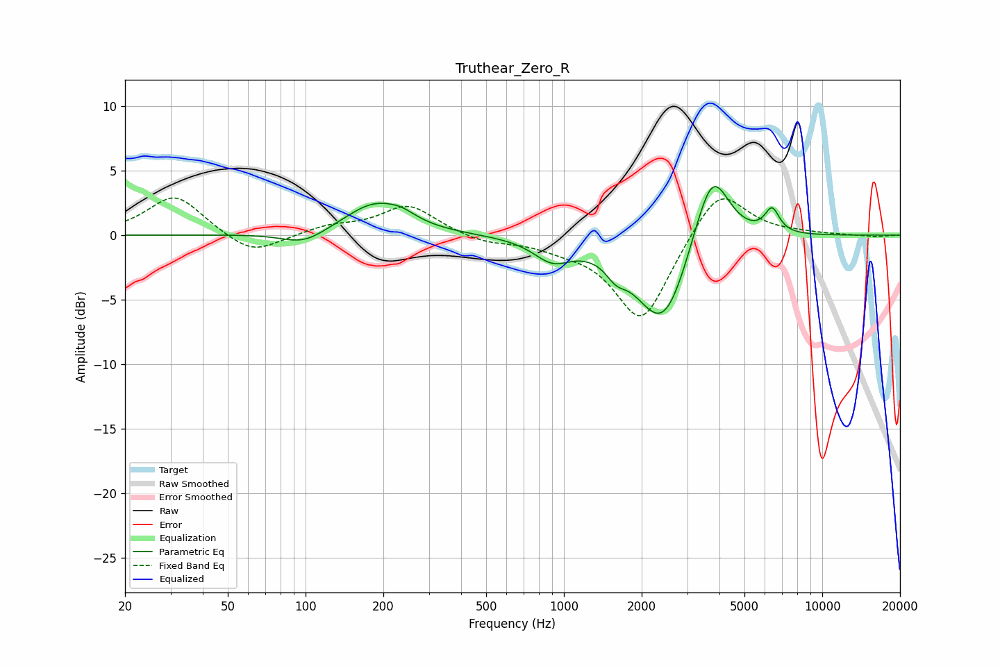

# Truthear_Zero_R
See [usage instructions](https://github.com/jaakkopasanen/AutoEq#usage) for more options and info.

### Parametric EQs
Apply preamp of -3.9 dB when using parametric equalizer.

|   # | Type    |   Fc (Hz) |    Q |   Gain (dB) |
|-----|---------|-----------|------|-------------|
|   1 | Peaking |        99 | 1.68 |        -1   |
|   2 | Peaking |       186 | 1.19 |         2.5 |
|   3 | Peaking |       236 | 2.68 |         0.4 |
|   4 | Peaking |       903 | 1.95 |        -1.6 |
|   5 | Peaking |      1590 | 3.73 |        -1.1 |
|   6 | Peaking |      2232 | 1.35 |        -1.4 |
|   7 | Peaking |      2461 | 1.41 |        -6   |
|   8 | Peaking |      3343 | 1.89 |         1   |
|   9 | Peaking |      3768 | 2.12 |         5.6 |
|  10 | Peaking |      6396 | 4.85 |         1.9 |

### Fixed Band EQs
When using fixed band (also called graphic) equalizer, apply preamp of **-3.0 dB** (if available) and set gains manually with these parameters.

|   # | Type    |   Fc (Hz) |    Q |   Gain (dB) |
|-----|---------|-----------|------|-------------|
|   1 | Peaking |        31 | 1.41 |         3.1 |
|   2 | Peaking |        62 | 1.41 |        -1.7 |
|   3 | Peaking |       125 | 1.41 |         0.6 |
|   4 | Peaking |       250 | 1.41 |         2.3 |
|   5 | Peaking |       500 | 1.41 |        -0.6 |
|   6 | Peaking |      1000 | 1.41 |        -0.6 |
|   7 | Peaking |      2000 | 1.41 |        -6.8 |
|   8 | Peaking |      4000 | 1.41 |         4   |
|   9 | Peaking |      8000 | 1.41 |         0.1 |
|  10 | Peaking |     16000 | 1.41 |        -0.1 |

### Graphs

