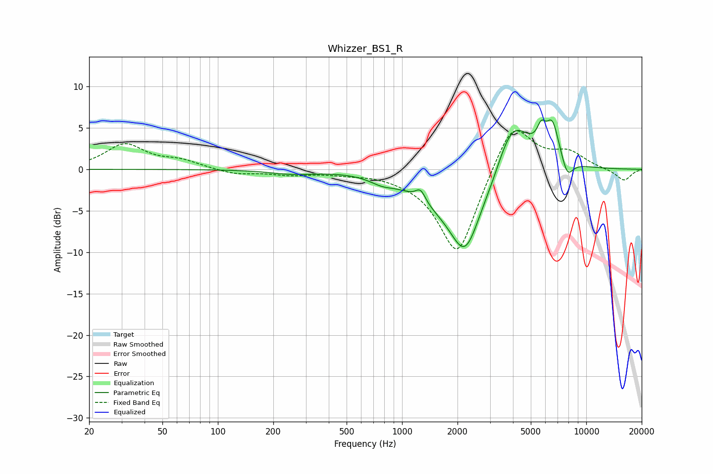

# Whizzer_BS1_R
See [usage instructions](https://github.com/jaakkopasanen/AutoEq#usage) for more options and info.

### Parametric EQs
Apply preamp of -6.1 dB when using parametric equalizer.

|   # | Type    |   Fc (Hz) |    Q |   Gain (dB) |
|-----|---------|-----------|------|-------------|
|   1 | Peaking |       252 | 1.19 |        -0.5 |
|   2 | Peaking |       778 | 2.16 |        -0.7 |
|   3 | Peaking |      1260 | 5.2  |         1.5 |
|   4 | Peaking |      1452 | 0.97 |        -2.1 |
|   5 | Peaking |      2203 | 1.55 |        -9.4 |
|   6 | Peaking |      3119 | 1.95 |        -1.3 |
|   7 | Peaking |      3948 | 1.39 |         7.1 |
|   8 | Peaking |      5698 | 5.99 |         2.1 |
|   9 | Peaking |      6552 | 3.66 |         4.5 |
|  10 | Peaking |      7893 | 4.28 |        -2.2 |

### Fixed Band EQs
When using fixed band (also called graphic) equalizer, apply preamp of **-4.8 dB** (if available) and set gains manually with these parameters.

|   # | Type    |   Fc (Hz) |    Q |   Gain (dB) |
|-----|---------|-----------|------|-------------|
|   1 | Peaking |        31 | 1.41 |         3   |
|   2 | Peaking |        62 | 1.41 |         0.9 |
|   3 | Peaking |       125 | 1.41 |        -0.6 |
|   4 | Peaking |       250 | 1.41 |        -0.6 |
|   5 | Peaking |       500 | 1.41 |        -0.3 |
|   6 | Peaking |      1000 | 1.41 |        -0.3 |
|   7 | Peaking |      2000 | 1.41 |       -10.7 |
|   8 | Peaking |      4000 | 1.41 |         6.3 |
|   9 | Peaking |      8000 | 1.41 |         1.9 |
|  10 | Peaking |     16000 | 1.41 |        -1.4 |

### Graphs

