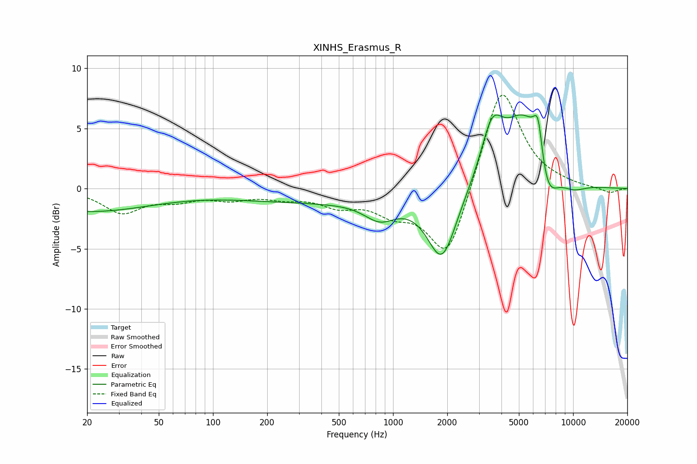

# XINHS_Erasmus_R
See [usage instructions](https://github.com/jaakkopasanen/AutoEq#usage) for more options and info.

### Parametric EQs
Apply preamp of -6.2 dB when using parametric equalizer.

|   # | Type    |   Fc (Hz) |    Q |   Gain (dB) |
|-----|---------|-----------|------|-------------|
|   1 | Peaking |        20 | 0.38 |        -1.9 |
|   2 | Peaking |       359 | 0.31 |        -1   |
|   3 | Peaking |       845 | 1.62 |        -1.6 |
|   4 | Peaking |      1871 | 1.73 |        -5.9 |
|   5 | Peaking |      3547 | 2.29 |         4.2 |
|   6 | Peaking |      5340 | 1.18 |         6.1 |
|   7 | Peaking |      6250 | 3.42 |         1.2 |
|   8 | Peaking |      6408 | 5.98 |         2.6 |
|   9 | Peaking |      7120 | 2.23 |        -3.8 |
|  10 | Peaking |     10000 | 1.66 |        -0.7 |

### Fixed Band EQs
When using fixed band (also called graphic) equalizer, apply preamp of **-7.9 dB** (if available) and set gains manually with these parameters.

|   # | Type    |   Fc (Hz) |    Q |   Gain (dB) |
|-----|---------|-----------|------|-------------|
|   1 | Peaking |        31 | 1.41 |        -1.9 |
|   2 | Peaking |        62 | 1.41 |        -0.8 |
|   3 | Peaking |       125 | 1.41 |        -0.7 |
|   4 | Peaking |       250 | 1.41 |        -0.6 |
|   5 | Peaking |       500 | 1.41 |        -1.2 |
|   6 | Peaking |      1000 | 1.41 |        -1.6 |
|   7 | Peaking |      2000 | 1.41 |        -6.2 |
|   8 | Peaking |      4000 | 1.41 |         8.9 |
|   9 | Peaking |      8000 | 1.41 |         0.2 |
|  10 | Peaking |     16000 | 1.41 |        -0.4 |

### Graphs

