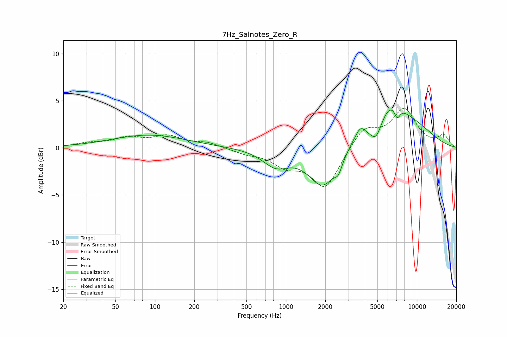

# 7Hz_Salnotes_Zero_R
See [usage instructions](https://github.com/jaakkopasanen/AutoEq#usage) for more options and info.

### Parametric EQs
Apply preamp of -4.1 dB when using parametric equalizer.

|   # | Type    |   Fc (Hz) |    Q |   Gain (dB) |
|-----|---------|-----------|------|-------------|
|   1 | Peaking |        90 | 0.5  |         1.4 |
|   2 | Peaking |       837 | 1.42 |        -1.7 |
|   3 | Peaking |      1918 | 1.32 |        -4   |
|   4 | Peaking |      2517 | 5.47 |        -1   |
|   5 | Peaking |      3206 | 2.72 |         0.4 |
|   6 | Peaking |      3714 | 3.38 |         1.6 |
|   7 | Peaking |      4897 | 3.37 |        -1.6 |
|   8 | Peaking |      6381 | 1.25 |         3.8 |
|   9 | Peaking |      7076 | 5.7  |        -1.3 |
|  10 | Peaking |      9527 | 0.73 |         1.8 |

### Fixed Band EQs
When using fixed band (also called graphic) equalizer, apply preamp of **-4.3 dB** (if available) and set gains manually with these parameters.

|   # | Type    |   Fc (Hz) |    Q |   Gain (dB) |
|-----|---------|-----------|------|-------------|
|   1 | Peaking |        31 | 1.41 |         0.4 |
|   2 | Peaking |        62 | 1.41 |         1   |
|   3 | Peaking |       125 | 1.41 |         1.1 |
|   4 | Peaking |       250 | 1.41 |         0.5 |
|   5 | Peaking |       500 | 1.41 |        -0.5 |
|   6 | Peaking |      1000 | 1.41 |        -1.6 |
|   7 | Peaking |      2000 | 1.41 |        -4.3 |
|   8 | Peaking |      4000 | 1.41 |         2.2 |
|   9 | Peaking |      8000 | 1.41 |         3.9 |
|  10 | Peaking |     16000 | 1.41 |         1.2 |

### Graphs

