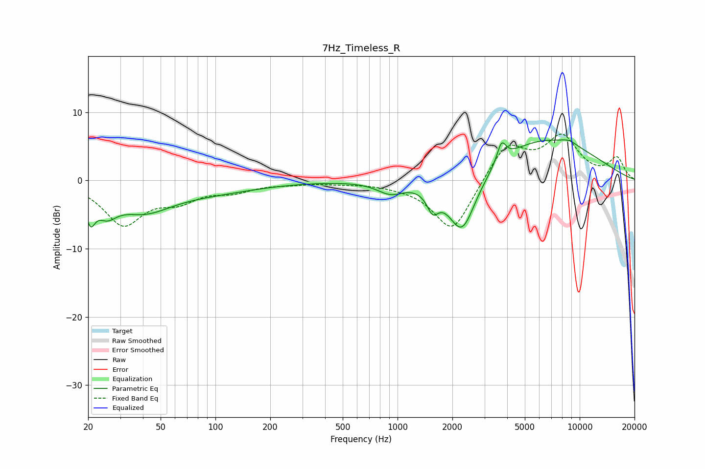

# 7Hz_Timeless_R
See [usage instructions](https://github.com/jaakkopasanen/AutoEq#usage) for more options and info.

### Parametric EQs
Apply preamp of -6.0 dB when using parametric equalizer.

|   # | Type    |   Fc (Hz) |    Q |   Gain (dB) |
|-----|---------|-----------|------|-------------|
|   1 | Peaking |        21 | 5.63 |        -3.8 |
|   2 | Peaking |        25 | 2.53 |        -2.9 |
|   3 | Peaking |        40 | 0.91 |        -3.8 |
|   4 | Peaking |        95 | 0.52 |        -1.4 |
|   5 | Peaking |       915 | 1.92 |        -1.8 |
|   6 | Peaking |      1559 | 4.43 |        -2.8 |
|   7 | Peaking |      2260 | 1.73 |        -9.3 |
|   8 | Peaking |      3723 | 5.75 |         2.9 |
|   9 | Peaking |      6281 | 0.43 |         6.2 |
|  10 | Peaking |      8761 | 3.04 |         0.6 |

### Fixed Band EQs
When using fixed band (also called graphic) equalizer, apply preamp of **-6.9 dB** (if available) and set gains manually with these parameters.

|   # | Type    |   Fc (Hz) |    Q |   Gain (dB) |
|-----|---------|-----------|------|-------------|
|   1 | Peaking |        31 | 1.41 |        -6.2 |
|   2 | Peaking |        62 | 1.41 |        -2.4 |
|   3 | Peaking |       125 | 1.41 |        -1.3 |
|   4 | Peaking |       250 | 1.41 |        -0.3 |
|   5 | Peaking |       500 | 1.41 |        -0.3 |
|   6 | Peaking |      1000 | 1.41 |        -0.4 |
|   7 | Peaking |      2000 | 1.41 |        -7.7 |
|   8 | Peaking |      4000 | 1.41 |         5.5 |
|   9 | Peaking |      8000 | 1.41 |         6   |
|  10 | Peaking |     16000 | 1.41 |         3.2 |

### Graphs

