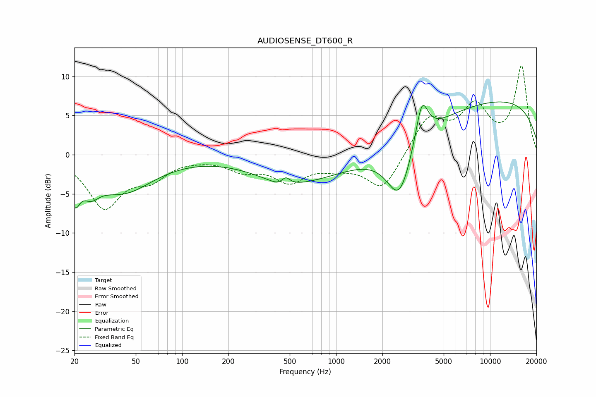

# AUDIOSENSE_DT600_R
See [usage instructions](https://github.com/jaakkopasanen/AutoEq#usage) for more options and info.

### Parametric EQs
Apply preamp of -6.8 dB when using parametric equalizer.

|   # | Type    |   Fc (Hz) |    Q |   Gain (dB) |
|-----|---------|-----------|------|-------------|
|   1 | Peaking |        20 | 4.57 |        -3.8 |
|   2 | Peaking |        25 | 2.56 |        -2.3 |
|   3 | Peaking |        41 | 0.72 |        -4.6 |
|   4 | Peaking |       434 | 2.54 |        -0.5 |
|   5 | Peaking |       471 | 5.32 |         1   |
|   6 | Peaking |       484 | 0.64 |        -2   |
|   7 | Peaking |      1577 | 0.25 |        -3   |
|   8 | Peaking |      2577 | 1.7  |        -7.3 |
|   9 | Peaking |      3608 | 3.5  |         5.5 |
|  10 | Peaking |      8802 | 0.18 |         7.4 |

### Fixed Band EQs
When using fixed band (also called graphic) equalizer, apply preamp of **-11.4 dB** (if available) and set gains manually with these parameters.

|   # | Type    |   Fc (Hz) |    Q |   Gain (dB) |
|-----|---------|-----------|------|-------------|
|   1 | Peaking |        31 | 1.41 |        -6.5 |
|   2 | Peaking |        62 | 1.41 |        -2.5 |
|   3 | Peaking |       125 | 1.41 |        -0.2 |
|   4 | Peaking |       250 | 1.41 |        -1.7 |
|   5 | Peaking |       500 | 1.41 |        -3.1 |
|   6 | Peaking |      1000 | 1.41 |        -1.2 |
|   7 | Peaking |      2000 | 1.41 |        -4.5 |
|   8 | Peaking |      4000 | 1.41 |         4.7 |
|   9 | Peaking |      8000 | 1.41 |         5.6 |
|  10 | Peaking |     16000 | 1.41 |        11.1 |

### Graphs

