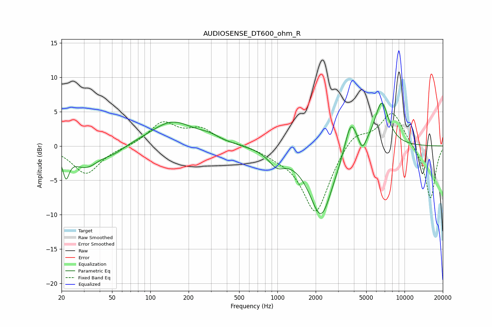

# AUDIOSENSE_DT600_ohm_R
See [usage instructions](https://github.com/jaakkopasanen/AutoEq#usage) for more options and info.

### Parametric EQs
Apply preamp of -6.3 dB when using parametric equalizer.

|   # | Type    |   Fc (Hz) |    Q |   Gain (dB) |
|-----|---------|-----------|------|-------------|
|   1 | Peaking |        22 | 5.71 |        -3.4 |
|   2 | Peaking |        31 | 1.35 |        -3   |
|   3 | Peaking |        52 | 1.67 |        -0.8 |
|   4 | Peaking |       149 | 0.83 |         3.5 |
|   5 | Peaking |       291 | 1.76 |         0.7 |
|   6 | Peaking |       986 | 2.22 |        -2   |
|   7 | Peaking |      2205 | 1.48 |       -10.3 |
|   8 | Peaking |      3777 | 2.89 |         5.2 |
|   9 | Peaking |      4657 | 4.87 |        -1.8 |
|  10 | Peaking |      6605 | 2.41 |         6.6 |

### Fixed Band EQs
When using fixed band (also called graphic) equalizer, apply preamp of **-4.8 dB** (if available) and set gains manually with these parameters.

|   # | Type    |   Fc (Hz) |    Q |   Gain (dB) |
|-----|---------|-----------|------|-------------|
|   1 | Peaking |        31 | 1.41 |        -4.1 |
|   2 | Peaking |        62 | 1.41 |        -0.1 |
|   3 | Peaking |       125 | 1.41 |         3.3 |
|   4 | Peaking |       250 | 1.41 |         2.2 |
|   5 | Peaking |       500 | 1.41 |         0.2 |
|   6 | Peaking |      1000 | 1.41 |        -0.8 |
|   7 | Peaking |      2000 | 1.41 |        -9.9 |
|   8 | Peaking |      4000 | 1.41 |         2.4 |
|   9 | Peaking |      8000 | 1.41 |         5.1 |
|  10 | Peaking |     16000 | 1.41 |        -7.8 |

### Graphs

