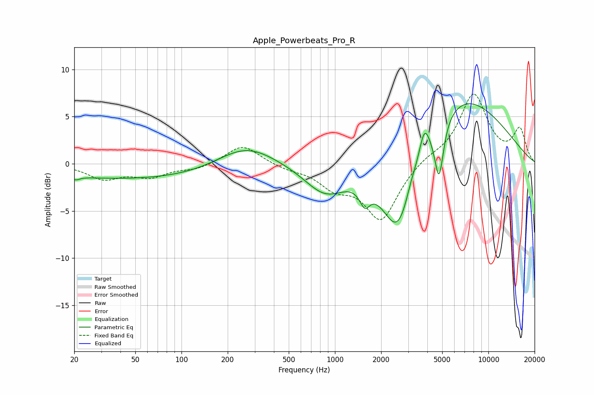

# Apple_Powerbeats_Pro_R
See [usage instructions](https://github.com/jaakkopasanen/AutoEq#usage) for more options and info.

### Parametric EQs
Apply preamp of -6.5 dB when using parametric equalizer.

|   # | Type    |   Fc (Hz) |    Q |   Gain (dB) |
|-----|---------|-----------|------|-------------|
|   1 | Peaking |        20 | 5.6  |        -0.4 |
|   2 | Peaking |        56 | 0.2  |        -1.7 |
|   3 | Peaking |       261 | 0.74 |         2.6 |
|   4 | Peaking |       866 | 1.03 |        -3.2 |
|   5 | Peaking |      1563 | 4.29 |        -1.9 |
|   6 | Peaking |      2587 | 1.24 |        -9.9 |
|   7 | Peaking |      3124 | 4.63 |         0.7 |
|   8 | Peaking |      3821 | 4.29 |         2.9 |
|   9 | Peaking |      4772 | 4.81 |        -6   |
|  10 | Peaking |      6267 | 0.43 |         7.7 |

### Fixed Band EQs
When using fixed band (also called graphic) equalizer, apply preamp of **-7.5 dB** (if available) and set gains manually with these parameters.

|   # | Type    |   Fc (Hz) |    Q |   Gain (dB) |
|-----|---------|-----------|------|-------------|
|   1 | Peaking |        31 | 1.41 |        -1.5 |
|   2 | Peaking |        62 | 1.41 |        -1.3 |
|   3 | Peaking |       125 | 1.41 |        -0.6 |
|   4 | Peaking |       250 | 1.41 |         2.1 |
|   5 | Peaking |       500 | 1.41 |        -0.5 |
|   6 | Peaking |      1000 | 1.41 |        -2.1 |
|   7 | Peaking |      2000 | 1.41 |        -5.9 |
|   8 | Peaking |      4000 | 1.41 |         0.6 |
|   9 | Peaking |      8000 | 1.41 |         7.3 |
|  10 | Peaking |     16000 | 1.41 |         3.5 |

### Graphs

