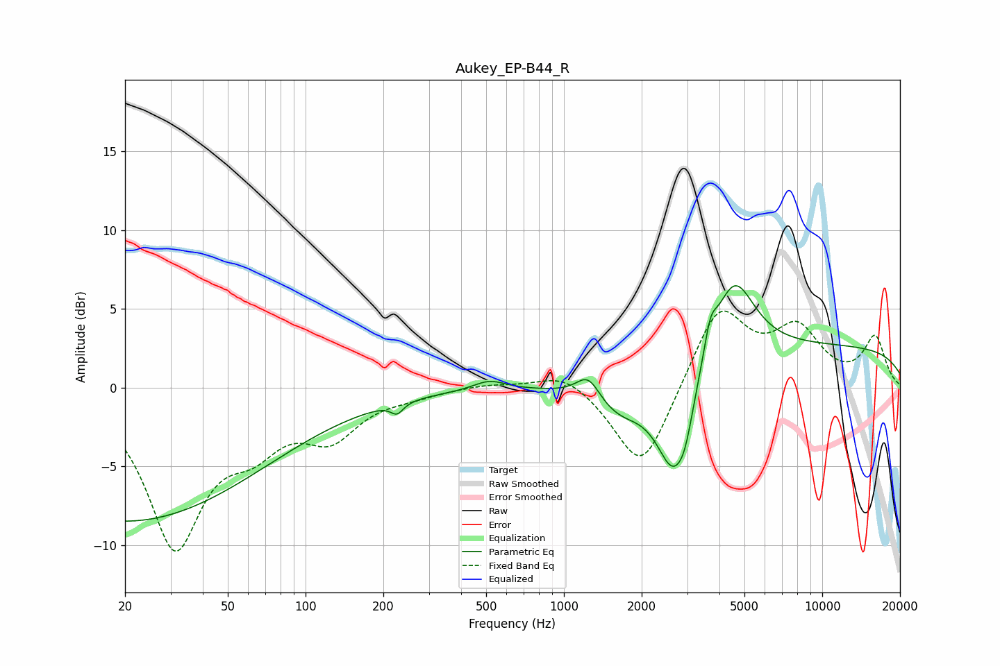

# Aukey_EP-B44_R
See [usage instructions](https://github.com/jaakkopasanen/AutoEq#usage) for more options and info.

### Parametric EQs
Apply preamp of -6.6 dB when using parametric equalizer.

|   # | Type    |   Fc (Hz) |    Q |   Gain (dB) |
|-----|---------|-----------|------|-------------|
|   1 | Peaking |        20 | 0.26 |        -8.5 |
|   2 | Peaking |       226 | 5.88 |        -0.7 |
|   3 | Peaking |       514 | 2.27 |         0.6 |
|   4 | Peaking |      1243 | 3.01 |         1.6 |
|   5 | Peaking |      1635 | 1.25 |        -2.1 |
|   6 | Peaking |      2673 | 2.03 |        -6.5 |
|   7 | Peaking |      2949 | 4.99 |        -1.2 |
|   8 | Peaking |      3685 | 5.77 |         1.8 |
|   9 | Peaking |      4533 | 1.73 |         5.2 |
|  10 | Peaking |     10000 | 0.18 |         2.6 |

### Fixed Band EQs
When using fixed band (also called graphic) equalizer, apply preamp of **-5.0 dB** (if available) and set gains manually with these parameters.

|   # | Type    |   Fc (Hz) |    Q |   Gain (dB) |
|-----|---------|-----------|------|-------------|
|   1 | Peaking |        31 | 1.41 |        -9.8 |
|   2 | Peaking |        62 | 1.41 |        -2.6 |
|   3 | Peaking |       125 | 1.41 |        -2.8 |
|   4 | Peaking |       250 | 1.41 |        -0.3 |
|   5 | Peaking |       500 | 1.41 |         0.3 |
|   6 | Peaking |      1000 | 1.41 |         1.1 |
|   7 | Peaking |      2000 | 1.41 |        -5.5 |
|   8 | Peaking |      4000 | 1.41 |         5.2 |
|   9 | Peaking |      8000 | 1.41 |         3.4 |
|  10 | Peaking |     16000 | 1.41 |         3.1 |

### Graphs

