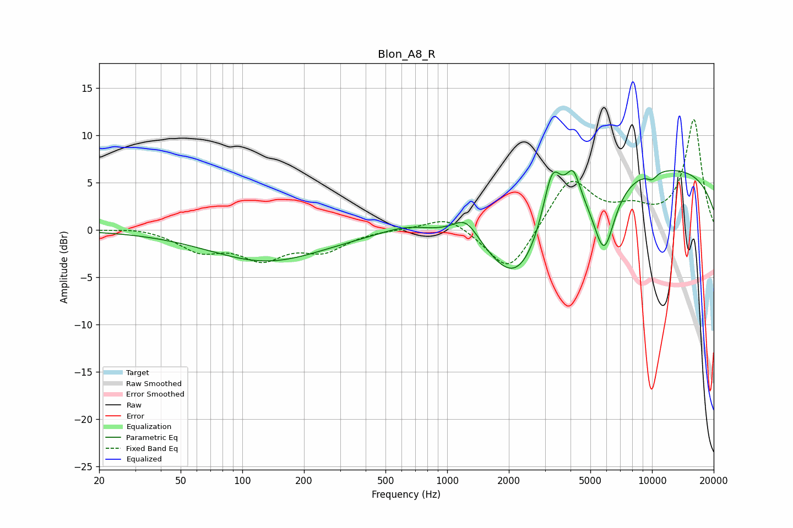

# Blon_A8_R
See [usage instructions](https://github.com/jaakkopasanen/AutoEq#usage) for more options and info.

### Parametric EQs
Apply preamp of -6.4 dB when using parametric equalizer.

|   # | Type    |   Fc (Hz) |    Q |   Gain (dB) |
|-----|---------|-----------|------|-------------|
|   1 | Peaking |       132 | 0.5  |        -3.3 |
|   2 | Peaking |       623 | 1.23 |         0.8 |
|   3 | Peaking |      1235 | 2.25 |         2.3 |
|   4 | Peaking |      2186 | 0.94 |        -6.2 |
|   5 | Peaking |      2274 | 0.94 |        -2.5 |
|   6 | Peaking |      3254 | 3.05 |         6.1 |
|   7 | Peaking |      4122 | 4.09 |         3.4 |
|   8 | Peaking |      5831 | 2.55 |        -7.4 |
|   9 | Peaking |      9353 | 0.18 |         6.9 |
|  10 | Peaking |     10000 | 4.88 |        -0.7 |

### Fixed Band EQs
When using fixed band (also called graphic) equalizer, apply preamp of **-11.7 dB** (if available) and set gains manually with these parameters.

|   # | Type    |   Fc (Hz) |    Q |   Gain (dB) |
|-----|---------|-----------|------|-------------|
|   1 | Peaking |        31 | 1.41 |         0.3 |
|   2 | Peaking |        62 | 1.41 |        -2   |
|   3 | Peaking |       125 | 1.41 |        -2.7 |
|   4 | Peaking |       250 | 1.41 |        -2   |
|   5 | Peaking |       500 | 1.41 |         0.1 |
|   6 | Peaking |      1000 | 1.41 |         1.6 |
|   7 | Peaking |      2000 | 1.41 |        -4.9 |
|   8 | Peaking |      4000 | 1.41 |         5.5 |
|   9 | Peaking |      8000 | 1.41 |         1.7 |
|  10 | Peaking |     16000 | 1.41 |        11.6 |

### Graphs

