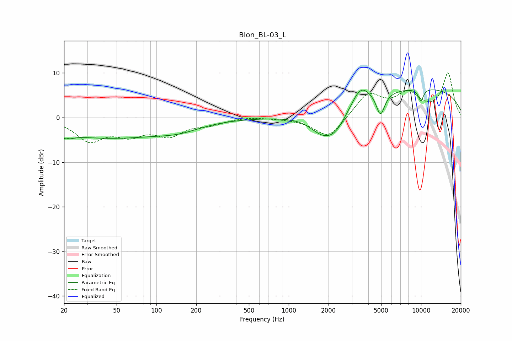

# Blon_BL-03_L
See [usage instructions](https://github.com/jaakkopasanen/AutoEq#usage) for more options and info.

### Parametric EQs
Apply preamp of -6.3 dB when using parametric equalizer.

|   # | Type    |   Fc (Hz) |    Q |   Gain (dB) |
|-----|---------|-----------|------|-------------|
|   1 | Peaking |        20 | 4.21 |        -3.9 |
|   2 | Peaking |        21 | 5.88 |         2.9 |
|   3 | Peaking |        42 | 0.31 |        -4.4 |
|   4 | Peaking |       149 | 0.86 |        -1.5 |
|   5 | Peaking |      1723 | 1.7  |        -2.1 |
|   6 | Peaking |      2196 | 1.29 |        -6   |
|   7 | Peaking |      3486 | 1.95 |         4.4 |
|   8 | Peaking |      4940 | 4.31 |        -5.2 |
|   9 | Peaking |      9689 | 0.22 |         6.6 |
|  10 | Peaking |      9979 | 6    |        -2.7 |

### Fixed Band EQs
When using fixed band (also called graphic) equalizer, apply preamp of **-10.1 dB** (if available) and set gains manually with these parameters.

|   # | Type    |   Fc (Hz) |    Q |   Gain (dB) |
|-----|---------|-----------|------|-------------|
|   1 | Peaking |        31 | 1.41 |        -4.9 |
|   2 | Peaking |        62 | 1.41 |        -3.2 |
|   3 | Peaking |       125 | 1.41 |        -3.5 |
|   4 | Peaking |       250 | 1.41 |        -1.3 |
|   5 | Peaking |       500 | 1.41 |         0.3 |
|   6 | Peaking |      1000 | 1.41 |        -0.1 |
|   7 | Peaking |      2000 | 1.41 |        -4.8 |
|   8 | Peaking |      4000 | 1.41 |         5.3 |
|   9 | Peaking |      8000 | 1.41 |         4.8 |
|  10 | Peaking |     16000 | 1.41 |         9.8 |

### Graphs

