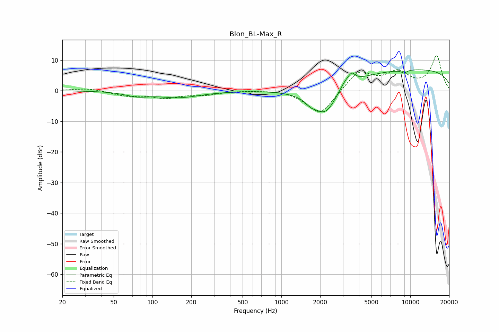

# Blon_BL-Max_R
See [usage instructions](https://github.com/jaakkopasanen/AutoEq#usage) for more options and info.

### Parametric EQs
Apply preamp of -6.9 dB when using parametric equalizer.

|   # | Type    |   Fc (Hz) |    Q |   Gain (dB) |
|-----|---------|-----------|------|-------------|
|   1 | Peaking |        76 | 1.52 |        -1.4 |
|   2 | Peaking |       165 | 0.91 |        -2.3 |
|   3 | Peaking |       180 | 1.41 |         0.3 |
|   4 | Peaking |      1688 | 3.98 |        -1.3 |
|   5 | Peaking |      2051 | 0.85 |        -2.8 |
|   6 | Peaking |      2199 | 1.53 |        -7.9 |
|   7 | Peaking |      3167 | 2.56 |         3.1 |
|   8 | Peaking |      3525 | 5.72 |         2.1 |
|   9 | Peaking |      8969 | 5.95 |        -1   |
|  10 | Peaking |      9992 | 0.19 |         7   |

### Fixed Band EQs
When using fixed band (also called graphic) equalizer, apply preamp of **-11.6 dB** (if available) and set gains manually with these parameters.

|   # | Type    |   Fc (Hz) |    Q |   Gain (dB) |
|-----|---------|-----------|------|-------------|
|   1 | Peaking |        31 | 1.41 |         0.9 |
|   2 | Peaking |        62 | 1.41 |        -1.5 |
|   3 | Peaking |       125 | 1.41 |        -2.2 |
|   4 | Peaking |       250 | 1.41 |        -1.2 |
|   5 | Peaking |       500 | 1.41 |         0.1 |
|   6 | Peaking |      1000 | 1.41 |         0.5 |
|   7 | Peaking |      2000 | 1.41 |        -8.2 |
|   8 | Peaking |      4000 | 1.41 |         6.5 |
|   9 | Peaking |      8000 | 1.41 |         5.4 |
|  10 | Peaking |     16000 | 1.41 |        11.2 |

### Graphs

