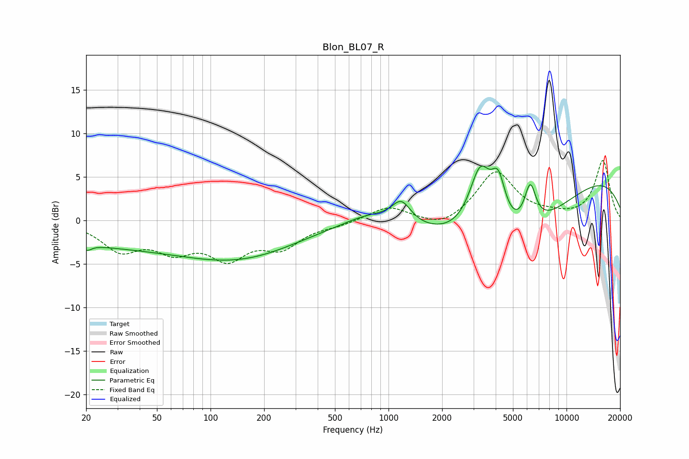

# Blon_BL07_R
See [usage instructions](https://github.com/jaakkopasanen/AutoEq#usage) for more options and info.

### Parametric EQs
Apply preamp of -6.4 dB when using parametric equalizer.

|   # | Type    |   Fc (Hz) |    Q |   Gain (dB) |
|-----|---------|-----------|------|-------------|
|   1 | Peaking |        20 | 5.8  |        -0.6 |
|   2 | Peaking |        48 | 0.19 |        -3   |
|   3 | Peaking |       158 | 0.46 |        -2.1 |
|   4 | Peaking |       792 | 0.92 |         1.5 |
|   5 | Peaking |      1181 | 2.66 |         2.5 |
|   6 | Peaking |      3275 | 2.16 |         7.9 |
|   7 | Peaking |      4138 | 3.41 |         5   |
|   8 | Peaking |      4562 | 0.41 |        -8.8 |
|   9 | Peaking |      6252 | 4.17 |         4.6 |
|  10 | Peaking |      9276 | 0.21 |         6.6 |

### Fixed Band EQs
When using fixed band (also called graphic) equalizer, apply preamp of **-7.0 dB** (if available) and set gains manually with these parameters.

|   # | Type    |   Fc (Hz) |    Q |   Gain (dB) |
|-----|---------|-----------|------|-------------|
|   1 | Peaking |        31 | 1.41 |        -3.1 |
|   2 | Peaking |        62 | 1.41 |        -2.9 |
|   3 | Peaking |       125 | 1.41 |        -3.8 |
|   4 | Peaking |       250 | 1.41 |        -2.7 |
|   5 | Peaking |       500 | 1.41 |        -0.4 |
|   6 | Peaking |      1000 | 1.41 |         1.6 |
|   7 | Peaking |      2000 | 1.41 |        -1.1 |
|   8 | Peaking |      4000 | 1.41 |         5.6 |
|   9 | Peaking |      8000 | 1.41 |         0.4 |
|  10 | Peaking |     16000 | 1.41 |         6.9 |

### Graphs

