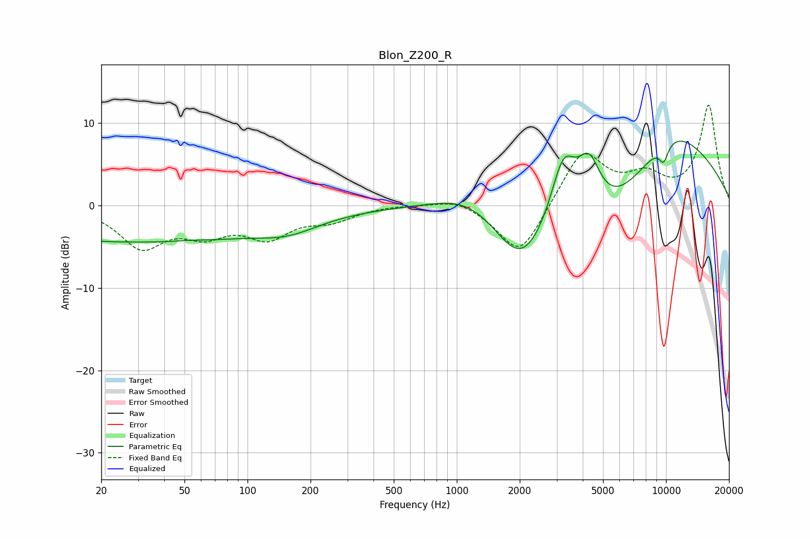

# Blon_Z200_R
See [usage instructions](https://github.com/jaakkopasanen/AutoEq#usage) for more options and info.

### Parametric EQs
Apply preamp of -7.9 dB when using parametric equalizer.

|   # | Type    |   Fc (Hz) |    Q |   Gain (dB) |
|-----|---------|-----------|------|-------------|
|   1 | Peaking |        28 | 0.18 |        -4.4 |
|   2 | Peaking |        52 | 2.54 |         0.1 |
|   3 | Peaking |       157 | 0.98 |        -1.5 |
|   4 | Peaking |      1200 | 0.79 |         3.7 |
|   5 | Peaking |      2026 | 1.12 |        -5.7 |
|   6 | Peaking |      3230 | 1.97 |         9.7 |
|   7 | Peaking |      4292 | 2.44 |         6.3 |
|   8 | Peaking |      4702 | 0.37 |        -9.8 |
|   9 | Peaking |      9748 | 5.46 |        -2.2 |
|  10 | Peaking |      9974 | 0.44 |        13.3 |

### Fixed Band EQs
When using fixed band (also called graphic) equalizer, apply preamp of **-12.3 dB** (if available) and set gains manually with these parameters.

|   # | Type    |   Fc (Hz) |    Q |   Gain (dB) |
|-----|---------|-----------|------|-------------|
|   1 | Peaking |        31 | 1.41 |        -4.8 |
|   2 | Peaking |        62 | 1.41 |        -2.8 |
|   3 | Peaking |       125 | 1.41 |        -3.4 |
|   4 | Peaking |       250 | 1.41 |        -1.6 |
|   5 | Peaking |       500 | 1.41 |         0.1 |
|   6 | Peaking |      1000 | 1.41 |         1.1 |
|   7 | Peaking |      2000 | 1.41 |        -6.4 |
|   8 | Peaking |      4000 | 1.41 |         6.7 |
|   9 | Peaking |      8000 | 1.41 |         2.9 |
|  10 | Peaking |     16000 | 1.41 |        12.1 |

### Graphs

