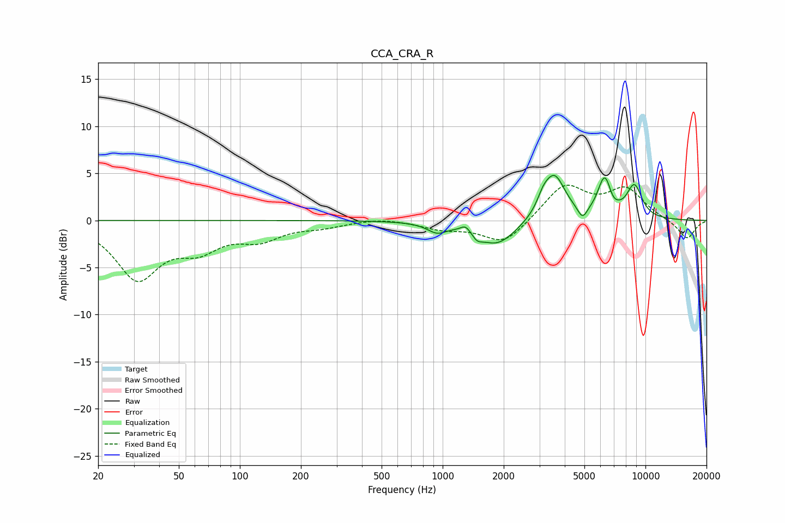

# CCA_CRA_R
See [usage instructions](https://github.com/jaakkopasanen/AutoEq#usage) for more options and info.

### Parametric EQs
Apply preamp of -4.9 dB when using parametric equalizer.

|   # | Type    |   Fc (Hz) |    Q |   Gain (dB) |
|-----|---------|-----------|------|-------------|
|   1 | Peaking |       937 | 2.95 |        -1   |
|   2 | Peaking |      1298 | 6    |         0.7 |
|   3 | Peaking |      1481 | 6    |        -0.6 |
|   4 | Peaking |      1850 | 1.48 |        -2.7 |
|   5 | Peaking |      3128 | 5.01 |         1   |
|   6 | Peaking |      3550 | 2.56 |         4.8 |
|   7 | Peaking |      4895 | 6    |        -1.3 |
|   8 | Peaking |      6292 | 4.05 |         4.1 |
|   9 | Peaking |      6905 | 5.96 |        -0.5 |
|  10 | Peaking |      8817 | 3.33 |         3.4 |

### Fixed Band EQs
When using fixed band (also called graphic) equalizer, apply preamp of **-3.8 dB** (if available) and set gains manually with these parameters.

|   # | Type    |   Fc (Hz) |    Q |   Gain (dB) |
|-----|---------|-----------|------|-------------|
|   1 | Peaking |        31 | 1.41 |        -6   |
|   2 | Peaking |        62 | 1.41 |        -2.5 |
|   3 | Peaking |       125 | 1.41 |        -1.7 |
|   4 | Peaking |       250 | 1.41 |        -0.6 |
|   5 | Peaking |       500 | 1.41 |         0.3 |
|   6 | Peaking |      1000 | 1.41 |        -0.8 |
|   7 | Peaking |      2000 | 1.41 |        -2.6 |
|   8 | Peaking |      4000 | 1.41 |         3.7 |
|   9 | Peaking |      8000 | 1.41 |         3.2 |
|  10 | Peaking |     16000 | 1.41 |        -2   |

### Graphs

