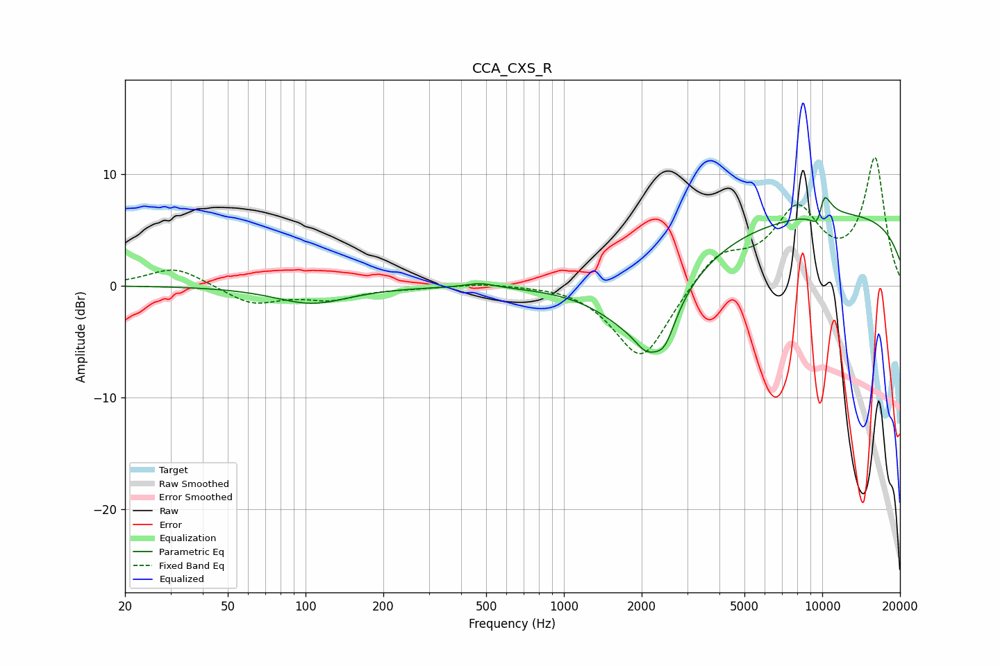

# CCA_CXS_R
See [usage instructions](https://github.com/jaakkopasanen/AutoEq#usage) for more options and info.

### Parametric EQs
Apply preamp of -8.0 dB when using parametric equalizer.

|   # | Type    |   Fc (Hz) |    Q |   Gain (dB) |
|-----|---------|-----------|------|-------------|
|   1 | Peaking |       106 | 0.99 |        -1.6 |
|   2 | Peaking |       475 | 2.54 |         0.4 |
|   3 | Peaking |      2038 | 0.91 |        -6.3 |
|   4 | Peaking |      2080 | 3.54 |        -1.4 |
|   5 | Peaking |      2450 | 3.22 |        -2.9 |
|   6 | Peaking |      9766 | 3.64 |        -3.9 |
|   7 | Peaking |      9830 | 5.97 |        -2   |
|   8 | Peaking |     10000 | 3.47 |         4.2 |
|   9 | Peaking |     10000 | 0.18 |         6.5 |
|  10 | Peaking |     10000 | 5.96 |         2.5 |

### Fixed Band EQs
When using fixed band (also called graphic) equalizer, apply preamp of **-11.5 dB** (if available) and set gains manually with these parameters.

|   # | Type    |   Fc (Hz) |    Q |   Gain (dB) |
|-----|---------|-----------|------|-------------|
|   1 | Peaking |        31 | 1.41 |         1.7 |
|   2 | Peaking |        62 | 1.41 |        -1.6 |
|   3 | Peaking |       125 | 1.41 |        -1.1 |
|   4 | Peaking |       250 | 1.41 |        -0.1 |
|   5 | Peaking |       500 | 1.41 |         0.3 |
|   6 | Peaking |      1000 | 1.41 |         0.2 |
|   7 | Peaking |      2000 | 1.41 |        -6.8 |
|   8 | Peaking |      4000 | 1.41 |         2.9 |
|   9 | Peaking |      8000 | 1.41 |         6.3 |
|  10 | Peaking |     16000 | 1.41 |        11.2 |

### Graphs

