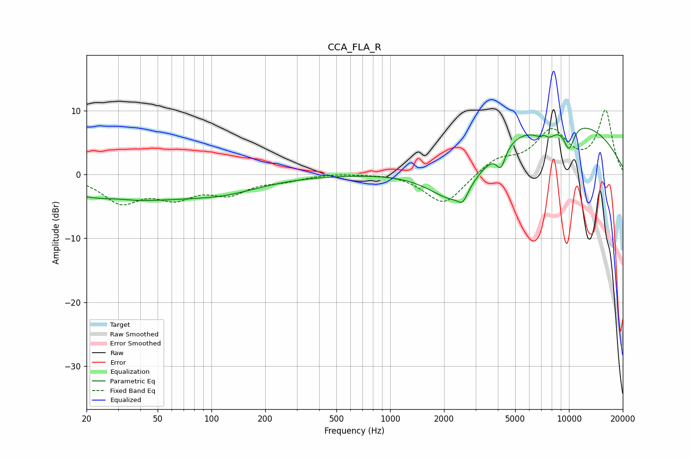

# CCA_FLA_R
See [usage instructions](https://github.com/jaakkopasanen/AutoEq#usage) for more options and info.

### Parametric EQs
Apply preamp of -7.3 dB when using parametric equalizer.

|   # | Type    |   Fc (Hz) |    Q |   Gain (dB) |
|-----|---------|-----------|------|-------------|
|   1 | Peaking |        30 | 2.14 |         0.2 |
|   2 | Peaking |        31 | 0.36 |        -3.8 |
|   3 | Peaking |       120 | 0.65 |        -1.8 |
|   4 | Peaking |      2318 | 0.91 |        -8.4 |
|   5 | Peaking |      2546 | 5.39 |        -1.7 |
|   6 | Peaking |      4163 | 5.58 |        -3   |
|   7 | Peaking |      7284 | 5.53 |         1.5 |
|   8 | Peaking |      7369 | 2.77 |        -3.4 |
|   9 | Peaking |      7754 | 0.25 |         9.4 |
|  10 | Peaking |     10000 | 4.03 |        -4   |

### Fixed Band EQs
When using fixed band (also called graphic) equalizer, apply preamp of **-10.2 dB** (if available) and set gains manually with these parameters.

|   # | Type    |   Fc (Hz) |    Q |   Gain (dB) |
|-----|---------|-----------|------|-------------|
|   1 | Peaking |        31 | 1.41 |        -4.1 |
|   2 | Peaking |        62 | 1.41 |        -3.1 |
|   3 | Peaking |       125 | 1.41 |        -2.6 |
|   4 | Peaking |       250 | 1.41 |        -0.8 |
|   5 | Peaking |       500 | 1.41 |         0.3 |
|   6 | Peaking |      1000 | 1.41 |         0.3 |
|   7 | Peaking |      2000 | 1.41 |        -4.8 |
|   8 | Peaking |      4000 | 1.41 |         2.3 |
|   9 | Peaking |      8000 | 1.41 |         6.4 |
|  10 | Peaking |     16000 | 1.41 |         9.8 |

### Graphs

