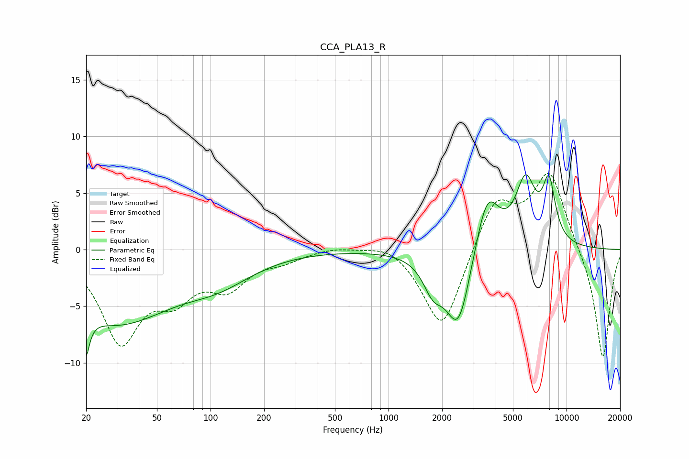

# CCA_PLA13_R
See [usage instructions](https://github.com/jaakkopasanen/AutoEq#usage) for more options and info.

### Parametric EQs
Apply preamp of -6.7 dB when using parametric equalizer.

|   # | Type    |   Fc (Hz) |    Q |   Gain (dB) |
|-----|---------|-----------|------|-------------|
|   1 | Peaking |        20 | 5.87 |        -7.1 |
|   2 | Peaking |        20 | 5.82 |         3.3 |
|   3 | Peaking |        29 | 0.47 |        -6.2 |
|   4 | Peaking |        55 | 1.84 |        -0   |
|   5 | Peaking |       110 | 0.7  |        -2.2 |
|   6 | Peaking |      1778 | 2.54 |        -2.5 |
|   7 | Peaking |      2469 | 1.97 |        -7.1 |
|   8 | Peaking |      3577 | 2.07 |         5.5 |
|   9 | Peaking |      5892 | 2.46 |         5.6 |
|  10 | Peaking |      7970 | 3.73 |         5.1 |

### Fixed Band EQs
When using fixed band (also called graphic) equalizer, apply preamp of **-6.8 dB** (if available) and set gains manually with these parameters.

|   # | Type    |   Fc (Hz) |    Q |   Gain (dB) |
|-----|---------|-----------|------|-------------|
|   1 | Peaking |        31 | 1.41 |        -7.8 |
|   2 | Peaking |        62 | 1.41 |        -3.3 |
|   3 | Peaking |       125 | 1.41 |        -2.9 |
|   4 | Peaking |       250 | 1.41 |        -0.8 |
|   5 | Peaking |       500 | 1.41 |         0.3 |
|   6 | Peaking |      1000 | 1.41 |         0.8 |
|   7 | Peaking |      2000 | 1.41 |        -7.3 |
|   8 | Peaking |      4000 | 1.41 |         4.5 |
|   9 | Peaking |      8000 | 1.41 |         6.8 |
|  10 | Peaking |     16000 | 1.41 |        -9.9 |

### Graphs

