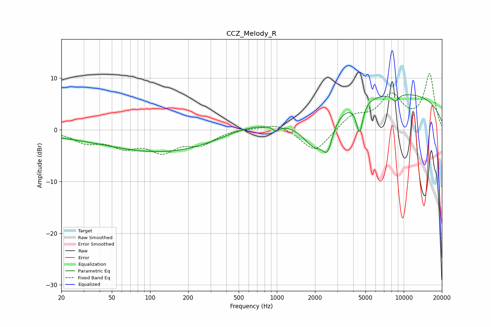

# CCZ_Melody_R
See [usage instructions](https://github.com/jaakkopasanen/AutoEq#usage) for more options and info.

### Parametric EQs
Apply preamp of -6.9 dB when using parametric equalizer.

|   # | Type    |   Fc (Hz) |    Q |   Gain (dB) |
|-----|---------|-----------|------|-------------|
|   1 | Peaking |        51 | 0.21 |        -1.2 |
|   2 | Peaking |       142 | 0.32 |        -3.3 |
|   3 | Peaking |       551 | 0.75 |         1.2 |
|   4 | Peaking |       984 | 5.98 |        -1   |
|   5 | Peaking |      1994 | 1.43 |        -6.7 |
|   6 | Peaking |      2509 | 3.72 |        -4.7 |
|   7 | Peaking |      4487 | 5.42 |        -5.9 |
|   8 | Peaking |      8035 | 0.18 |         7.2 |
|   9 | Peaking |      8577 | 4.8  |        -1.5 |
|  10 | Peaking |      8662 | 4.68 |         0.1 |

### Fixed Band EQs
When using fixed band (also called graphic) equalizer, apply preamp of **-11.0 dB** (if available) and set gains manually with these parameters.

|   # | Type    |   Fc (Hz) |    Q |   Gain (dB) |
|-----|---------|-----------|------|-------------|
|   1 | Peaking |        31 | 1.41 |        -2.2 |
|   2 | Peaking |        62 | 1.41 |        -2.8 |
|   3 | Peaking |       125 | 1.41 |        -3.7 |
|   4 | Peaking |       250 | 1.41 |        -2.5 |
|   5 | Peaking |       500 | 1.41 |         0.3 |
|   6 | Peaking |      1000 | 1.41 |         1.4 |
|   7 | Peaking |      2000 | 1.41 |        -4.5 |
|   8 | Peaking |      4000 | 1.41 |         2.7 |
|   9 | Peaking |      8000 | 1.41 |         6.2 |
|  10 | Peaking |     16000 | 1.41 |        10.6 |

### Graphs

