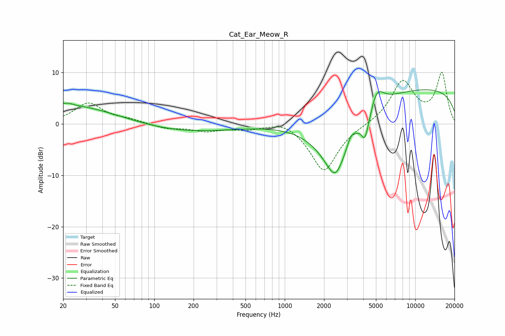

# Cat_Ear_Meow_R
See [usage instructions](https://github.com/jaakkopasanen/AutoEq#usage) for more options and info.

### Parametric EQs
Apply preamp of -6.7 dB when using parametric equalizer.

|   # | Type    |   Fc (Hz) |    Q |   Gain (dB) |
|-----|---------|-----------|------|-------------|
|   1 | Peaking |        20 | 0.36 |         3.8 |
|   2 | Peaking |        22 | 4.72 |         0.4 |
|   3 | Peaking |       172 | 0.38 |        -1.6 |
|   4 | Peaking |      2438 | 0.96 |       -10.9 |
|   5 | Peaking |      2440 | 2.69 |        -2.7 |
|   6 | Peaking |      3200 | 5.37 |         1.6 |
|   7 | Peaking |      4107 | 5.68 |        -3.3 |
|   8 | Peaking |      4358 | 3.29 |        -1.8 |
|   9 | Peaking |      5051 | 2.65 |         4.2 |
|  10 | Peaking |     10000 | 0.18 |         7   |

### Fixed Band EQs
When using fixed band (also called graphic) equalizer, apply preamp of **-10.1 dB** (if available) and set gains manually with these parameters.

|   # | Type    |   Fc (Hz) |    Q |   Gain (dB) |
|-----|---------|-----------|------|-------------|
|   1 | Peaking |        31 | 1.41 |         4   |
|   2 | Peaking |        62 | 1.41 |         0.7 |
|   3 | Peaking |       125 | 1.41 |        -0.9 |
|   4 | Peaking |       250 | 1.41 |        -1.3 |
|   5 | Peaking |       500 | 1.41 |        -0.9 |
|   6 | Peaking |      1000 | 1.41 |         1.1 |
|   7 | Peaking |      2000 | 1.41 |        -9.3 |
|   8 | Peaking |      4000 | 1.41 |        -0.1 |
|   9 | Peaking |      8000 | 1.41 |         8.2 |
|  10 | Peaking |     16000 | 1.41 |         9.7 |

### Graphs

