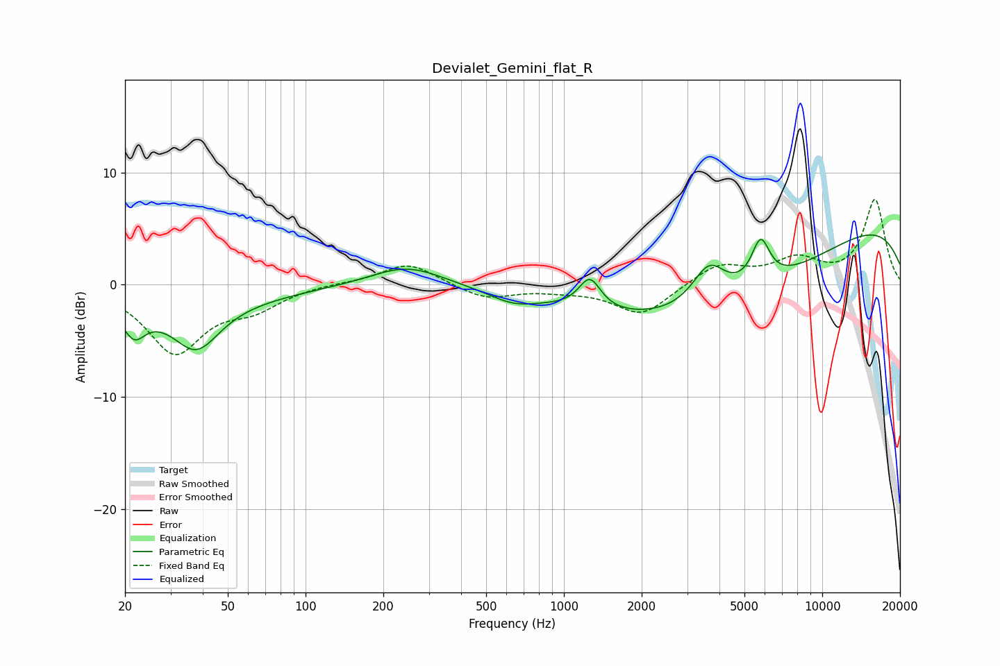

# Devialet_Gemini_flat_R
See [usage instructions](https://github.com/jaakkopasanen/AutoEq#usage) for more options and info.

### Parametric EQs
Apply preamp of -4.5 dB when using parametric equalizer.

|   # | Type    |   Fc (Hz) |    Q |   Gain (dB) |
|-----|---------|-----------|------|-------------|
|   1 | Peaking |        22 | 3.34 |        -2.5 |
|   2 | Peaking |        30 | 0.36 |        -1.6 |
|   3 | Peaking |        38 | 1.6  |        -4.1 |
|   4 | Peaking |       246 | 1.01 |         1.9 |
|   5 | Peaking |       636 | 1.51 |        -1   |
|   6 | Peaking |      1259 | 3.36 |         2.8 |
|   7 | Peaking |      3644 | 2.18 |         3.5 |
|   8 | Peaking |      4049 | 0.31 |        -7   |
|   9 | Peaking |      5774 | 3.88 |         3.8 |
|  10 | Peaking |     10000 | 0.21 |         6.8 |

### Fixed Band EQs
When using fixed band (also called graphic) equalizer, apply preamp of **-7.7 dB** (if available) and set gains manually with these parameters.

|   # | Type    |   Fc (Hz) |    Q |   Gain (dB) |
|-----|---------|-----------|------|-------------|
|   1 | Peaking |        31 | 1.41 |        -5.9 |
|   2 | Peaking |        62 | 1.41 |        -1.8 |
|   3 | Peaking |       125 | 1.41 |         0.1 |
|   4 | Peaking |       250 | 1.41 |         2   |
|   5 | Peaking |       500 | 1.41 |        -1.3 |
|   6 | Peaking |      1000 | 1.41 |        -0.3 |
|   7 | Peaking |      2000 | 1.41 |        -2.7 |
|   8 | Peaking |      4000 | 1.41 |         1.8 |
|   9 | Peaking |      8000 | 1.41 |         2.1 |
|  10 | Peaking |     16000 | 1.41 |         7.5 |

### Graphs

